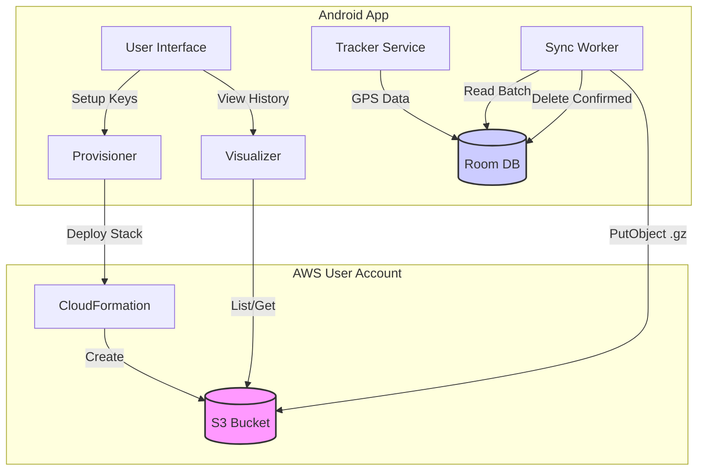

# Architecture: User-Owned Precision Tracker

This document serves as an index for the Locus project documentation.

## Documentation Index

*   **[Core Philosophy](docs/philosophy.md):** The guiding principles of data sovereignty and precision.
*   **[Infrastructure & Security](docs/infrastructure.md):** AWS S3, Authentication, Encryption, and Cost Projections.
*   **[Android Architecture](docs/android_architecture.md):** Details on the Android Client, Services, and Workers.
*   **[User Flows](docs/user_flows.md):** The bootstrap, daily usage, and recovery journeys.
*   **[Functional Requirements](docs/functional_requirements_index.md):** The detailed business rules and system behaviors.
*   **[Data Strategy](docs/data_strategy.md):** Storage format, Schema Versioning, and JSON structure.
*   **[Deployment](docs/deployment.md):** Building and distributing the application.
*   **[Operational Architecture](docs/operations/README.md):** Validation, Telemetry, and Resilience.
*   **[Implementation Process](docs/process_implementation_definition.md):** Steps to define technical specifics.

## High-Level Architecture

