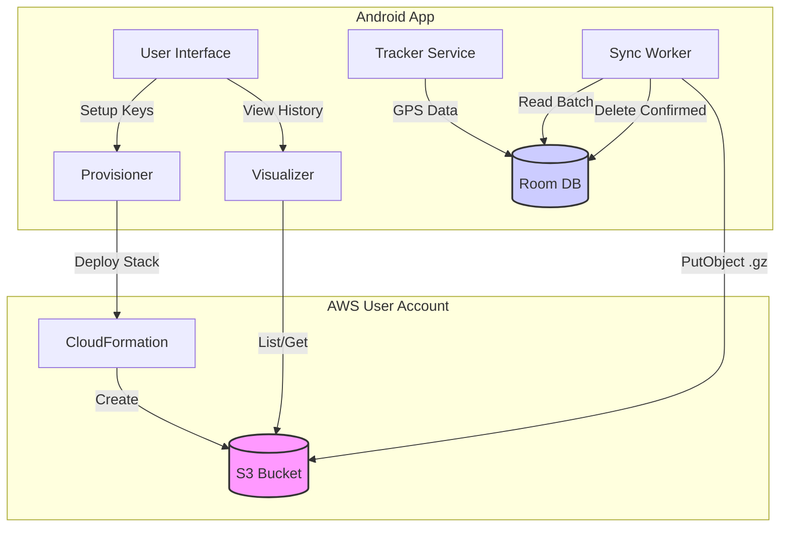

# Architecture: User-Owned Precision Tracker

## 1. Core Philosophy
*   **Data Sovereignty:** User owns the S3 bucket and keys.
*   **Precision:** 1Hz (1/second) tracking, 24/7.
*   **Efficiency:** Batched uploads, Gzip compression, Battery safety protocols.

## 2. Infrastructure & Security
*   **Storage:** AWS S3 (User Owned).
*   **Authentication:**
    *   **Setup:** User creates IAM User with a bootstrap policy.
    *   **Runtime:** App uses these keys to deploy CloudFormation and write/read data.
*   **Encryption:** Standard AWS S3 Server-Side Encryption (SSE-S3).
*   **Immutability:** S3 Object Lock (Compliance/Governance Mode) to prevent overwrites or deletion.

## 3. System Components

### A. Android Client
The Android application acts as both the data collector and the infrastructure controller.

1.  **Provisioner (Setup):**
    *   **Role:** One-time setup wizard.
    *   **Action:** Uses user-provided API Keys to deploy a **CloudFormation Stack**.
    *   **Outcome:** Creates the S3 Bucket with correct settings (Object Lock, Versioning).

2.  **Tracker Service (The Engine):**
    *   **Role:** Always-on data collection.
    *   **Component:** `ForegroundService` with `PARTIAL_WAKE_LOCK`.
    *   **Action:** Captures GPS (1Hz), buffers to local Room DB.
    *   **Safety:** Stops if battery < 10%.

3.  **Sync Worker (The Uploader):**
    *   **Role:** Reliable data transport.
    *   **Trigger:** Periodic (e.g., every 15 mins) via WorkManager.
    *   **Action:**
        *   Query oldest points from Room DB.
        *   Compress to Gzip.
        *   Upload to S3.
        *   **On Success:** Delete from local Room DB.

4.  **Visualizer (The View):**
    *   **Role:** User interface for history.
    *   **Action:**
        *   Lists S3 objects by date prefix.
        *   Downloads and decompresses tracks.
        *   Renders on OpenStreetMap (osmdroid).

### B. Backend (AWS CloudFormation)
The backend is serverless and purely composed of AWS managed resources owned by the user.

*   **S3 Bucket:**
    *   **Versioning:** Enabled (Required for Object Lock).
    *   **Object Lock:** Enabled (Prevents deletion/overwrite).
    *   **Retention:** Default Retention (e.g., 365 days or Indefinite).

### C. Architecture Diagram



## 4. Data Strategy
### A. Storage Format (S3)
*   **Format:** NDJSON (Newline Delimited JSON), Gzipped.
*   **Compression:** `.gz` (Expected ~90% size reduction).
*   **Path Structure:**
    `s3://<bucket_name>/tracks/YYYY/MM/DD/<device_id>_<start_timestamp>_v<version>.json.gz`

### B. Schema Versioning
*   **Current Version:** `v1`
*   **Strategy:** The filename includes the version (`_v1`). The JSON payload also includes a header object.

### C. JSON Schema (v1)
Each file is a Gzipped text file.
**Line 1 (Header):**
```json
{"type": "header", "version": 1, "device_id": "Pixel7_a8f3", "start_time": 1698300000}
```
**Lines 2..N (Data):**
```json
{"t": 1698300001, "lat": 37.7749, "lon": -122.4194, "acc": 4.5, "alt": 120, "spd": 1.2}
```

## 5. Deployment
*   **Distribution:** Manual APK Build (User builds from source).
*   **Permissions:** Critical UX flow to request `ACCESS_BACKGROUND_LOCATION` ("Allow all the time").

## 6. Cost Projections
*   **S3 Storage:** <$0.10/year (Compressed).
*   **Request Costs:** ~$0.02/month (Batched).
