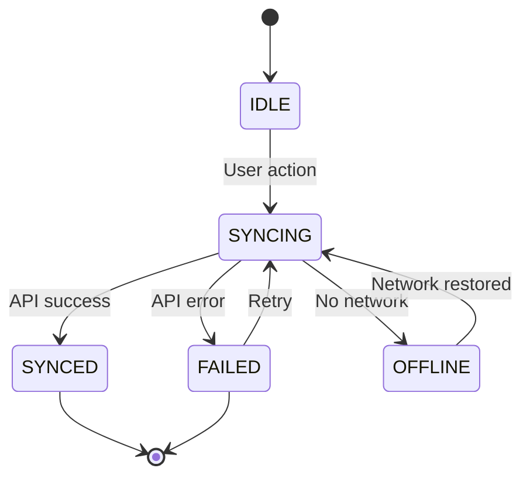

# Workflow: Technical Deep Dive

## Purpose

Dive deeper into specific technical areas that need tighter resolution before implementation. This is a **targeted, collaborative** workflow for areas where the architecture discovery left open questions or where implementation details matter for feasibility.

**Key Principles:**
- **Targeted, not comprehensive** - Only dive deep where needed
- **Collaborative** - Ask what needs detail, what can stay high-level
- **Practical** - Focus on unblocking implementation, not documentation for its own sake
- **Iterative** - Easy to add more detail or pivot based on feedback

## When to Use This Workflow

**After** architecture discovery is complete and approved.

**Use when:**
- Open questions from discovery need answers before implementation
- Complex integration requires detailed contract/schema design
- Error handling or state transitions need explicit mapping
- Performance/scalability concerns require sizing or load analysis
- Team needs more detail in specific area to feel confident

**Don't use when:**
- Architecture is still being decided (use collaborative-architecture-discovery instead)
- Implementation details can be figured out during coding
- You just want more documentation (resist the urge)

**Mobile app development scenarios where this workflow is especially valuable:**
- API client implementation requires detailed request/response contracts
- Offline-first or sync architecture needs state machine definition
- Third-party SDK integration requires configuration details
- Platform-specific implementation requires capability mapping
- Performance targets require latency/memory budgets

## Inputs

- Completed architecture discovery artifacts (options, BoM, repo-delta)
- Specific areas that need deeper resolution

## Storage Policy

Write artifacts under `./agents/ephemeral/{feature}-deep-dive/` (create if absent).
Organize by topic area (e.g., `schema-design.md`, `error-handling.md`, `state-machine.md`).

---

## Workflow Steps

### Step 0 — Collaborative Scoping

**STOP AND ASK FIRST** before diving deep.

Present the discovery artifacts and ask:
- "What specific areas need more detail before implementation?"
- "What are you trying to unblock or de-risk?"
- "Are there specific questions from the discovery phase we should answer?"
- "What can stay high-level for now?"

**Then** create a focused scope:
- List 2-5 specific topics to dive into
- For each topic, state the objective (what decision or understanding we need)
- Identify what's out of scope (what we're NOT detailing yet)

**Deliverable:** Scope document or conversation confirming focus areas

**Gate:** [ ] User has identified specific areas to dive into

---

### Step 1 — Gather Context

For each focus area, gather relevant context:
- What did the discovery phase say about this?
- What unknowns or risks were flagged?
- What existing patterns or code can inform this?
- What external contracts or APIs are involved?

**Approach:**
- Use codebase-retrieval to find existing patterns
- Review discovery artifacts for related decisions
- Identify external documentation needed (API specs, schemas, etc.)

**Deliverable:** Context summary (can be conversational or lightweight doc)

**Gate:** [ ] Relevant context gathered; [ ] Gaps identified

---

### Step 2 — Propose Approach

For each focus area, propose a specific approach:
- Present 1-2 options if there are meaningful tradeoffs
- Show concrete examples using schemas, state diagrams, error classification tables, and data structure definitions
- Highlight decisions being made and their implications
- Call out what's still flexible vs. what's locked in

**STOP AND ASK** before finalizing:
- "Does this approach make sense?"
- "Are there edge cases or scenarios I'm missing?"
- "Should we explore alternatives?"

**Deliverable:** One focused document per topic area

**Gate:** [ ] Approach proposed; [ ] User feedback incorporated

---

### Step 3 — Document Decisions

For each focus area, create a concise artifact:
- **Schema/Contract:** Exact payload structure, field types, validation rules
- **Error Handling:** Error classification table, retry logic, failure modes
- **State Machine:** State diagram, transition rules, terminal states
- **Sizing/Performance:** Load estimates, latency budgets, scaling approach
- **Integration Details:** Exact API calls, headers, auth, idempotency keys

**Format:** Use the format that best communicates the decision (tables for classifications, diagrams for flows and states, structured schemas for data contracts, prose for rationale)

**Keep it practical:**
- Include enough detail to implement confidently
- Exclude unnecessary ceremony
- Illustrate decisions with schemas, tables, and diagrams that show structure and relationships

**Deliverable:** Focused technical documents (1 per topic)

**Gate:** [ ] Decisions documented; [ ] Implementation-ready

---

### Step 4 — Update Discovery Artifacts (Optional)

If deep dive resolves open questions from discovery:
- Update BoM to remove resolved questions
- Add any new components/config discovered
- Update repo-delta if file list changed

**Deliverable:** Updated discovery artifacts (if needed)

**Gate:** [ ] Discovery artifacts reflect new understanding

---

## File Outputs

**Typical: 2-5 focused documents**

Examples:
- `./agents/ephemeral/{feature}-deep-dive/api-response-schema.md`
- `./agents/ephemeral/{feature}-deep-dive/data-model.md`
- `./agents/ephemeral/{feature}-deep-dive/error-handling.md`
- `./agents/ephemeral/{feature}-deep-dive/sync-state-machine.md`
- `./agents/ephemeral/{feature}-deep-dive/sdk-integration.md`

---

## Template Guidance

The templates below use JSON notation to define data structures and contracts. These represent **schema definitions** and **contract specifications**, not implementation code. Focus on:
- Data structure and field definitions
- Validation rules and constraints
- State transitions and classifications
- API contracts and integration points

---

## Templates

### Scope Document

```markdown
# Technical Deep Dive Scope: {Feature Name}

## Objective

{What we're trying to unblock or de-risk}

## Focus Areas

1. **{Topic}** - {Why we need detail here}
2. **{Topic}** - {Why we need detail here}
3. **{Topic}** - {Why we need detail here}

## Out of Scope

- {What we're NOT detailing yet}
- {What can be figured out during implementation}

## Success Criteria

- [ ] {Specific question answered}
- [ ] {Specific decision made}
- [ ] {Specific risk mitigated}
```

### API Response Schema / Data Model

```markdown
# API Response Schema: {Endpoint Name}

## Context

{Why this schema matters, what endpoint or system produces it}

## Schema Definition

Define the data contract using a structured format:

```json
{
  "id": "string (UUID)",
  "userId": "string",
  "timestamp": "string (ISO 8601)",
  "correlationId": "string (UUID, optional)",
  "data": {
    "resourceId": "string",
    "status": "string",
    "attributes": {}
  }
}
```

This represents the **data contract specification**, not implementation code.

## Field Descriptions

| Field | Type | Required | Description | Validation |
|-------|------|----------|-------------|------------|
| id | string | Yes | Unique resource identifier | UUID format |
| userId | string | Yes | User or account identifier | Non-empty string |
| timestamp | string | Yes | Server timestamp | ISO 8601 format |
| correlationId | string | No | Trace ID for distributed tracing | UUID format if present |
| data | object | Yes | Resource-specific data | Valid according to schema |
| ... | ... | ... | ... | ... |

## Example Payloads

**Happy Path:**
```json
{example}
```

**Edge Case:**
```json
{example}
```

## Open Questions

- {Question about schema}

## Decisions

- {Decision made about schema}
```

### Error Handling

```markdown
# Error Handling: {Feature Name}

## Context

{What errors we need to handle, why it matters}

## Error Classification

| Error Type | Example | Action | Retry? | Metric |
|------------|---------|--------|--------|--------|
| Validation | Invalid response format | Show error UI | No | api.errors.validation |
| Network | No connection | Queue for retry | Yes | api.errors.network |
| Server Error | API 5XX | Exponential backoff | Yes | api.errors.server |
| Client Error | API 4XX | Log and notify user | No | api.errors.client |
| Timeout | Request timeout | Retry with timeout | Yes | api.errors.timeout |

## Retry Policy

**Retryable Errors:**
- API 5XX, 429 (server errors, rate limits)
- Network timeouts, connection errors
- DNS resolution failures
- SSL/TLS errors (transient)

**Non-Retryable Errors:**
- Validation failures (malformed request)
- API 4XX (except 429) - client errors
- Authentication failures (401, 403)
- Resource not found (404)

**Retry Configuration:**
- Max attempts: 3
- Backoff: Exponential (1s, 2s, 4s)
- DLQ after max attempts

## Failure Modes

| Scenario | Behavior | Recovery |
|----------|----------|----------|
| {Scenario} | {What happens} | {How to recover} |

## Decisions

- {Decision about error handling}
```

### State Machine

```markdown
# State Machine: {Feature Name}

## Context

{What states we're tracking, why it matters}

## State Diagram



## State Definitions

| State | Meaning | Terminal? | Next States |
|-------|---------|-----------|-------------|
| IDLE | No active sync | No | SYNCING |
| SYNCING | API request in flight | No | SYNCED, FAILED, OFFLINE |
| SYNCED | Data synchronized | Yes | - |
| FAILED | Sync failed permanently | Yes | - |
| OFFLINE | No network available | No | SYNCING |

## Transition Rules

| From | To | Trigger | Validation |
|------|-----|---------|------------|
| IDLE | SYNCING | User initiates sync | Network available |
| SYNCING | SYNCED | API 200 OK | Valid response format |
| SYNCING | FAILED | API 4XX | Non-retryable error |
| SYNCING | OFFLINE | Network lost | - |
| OFFLINE | SYNCING | Network restored | Auto-retry enabled |

## Decisions

- {Decision about state machine}
```

### Integration Details

```markdown
# Integration: {Service Name}

## Context

{What we're integrating with, why}

## API Calls

### Call 1: {Operation Name}

**Endpoint:** `GET /api/v1/users/{userId}/profile`

**Headers:**
- `Authorization: Bearer {accessToken}`
- `X-Request-ID: {requestId}`
- `Content-Type: application/json`

**Response Schema:**
```json
{
  "id": "string",
  "username": "string",
  "profile": {
    "displayName": "string",
    "avatarUrl": "string (URL, optional)"
  }
}
```

This defines the expected response structure.

**Error Handling:**
- 401: Refresh token, retry once
- 404: Show empty state
- 5XX: Exponential backoff (3 retries)
- Timeout: Retry with increased timeout

### Call 2: {Operation Name}

{Same structure}

## Authentication

- OAuth2 authorization code flow with PKCE
- Scopes: `user:read`, `user:write`
- Token storage: Secure platform keychain {iOS: Keychain / Android: KeyStore}
- Token refresh: Automatic on 401 response

## Idempotency

- Use `X-Idempotency-Key: {uuid}` header for write operations
- Generate key from request parameters or use UUID
- Backend deduplicates requests within 24-hour window

## Decisions

- {Decision about integration}
```

### Sizing/Performance

```markdown
# Sizing and Performance: {Feature Name}

## Context

{What we're sizing, why it matters}

## Load Estimates

| Metric | Estimate | Source |
|--------|----------|--------|
| Daily active users | 50,000 | Analytics baseline |
| API requests/day | 500,000 | 10 requests/user avg |
| Peak requests/hour | 100,000 | Evening usage peak (6-8pm) |
| Avg API latency | 200ms | Backend SLA |
| p99 API latency | 1s | Including retries |
| Local storage size | 50MB | Cached data per user |

## Performance Targets

**API Response Times:**
- p50: < 200ms
- p95: < 500ms
- p99: < 1s

**App Performance:**
- Cold start: < 2s
- Screen transitions: < 100ms
- Local data queries: < 50ms
- Background sync: < 30s

## Latency Budget

| Operation | Budget | Actual (est) |
|-----------|--------|--------------|
| Network latency | 100ms | 50ms (WiFi), 150ms (LTE) |
| API processing | 200ms | 100ms |
| Response parsing | 50ms | 20ms |
| Local persistence | 50ms | 30ms |
| UI update | 100ms | 16ms (60fps) |
| **Total** | **500ms** | **~250ms** |

## Bottlenecks

- {Potential bottleneck}
- {Mitigation}

## Decisions

- {Decision about sizing}
```

---

## Guardrails

### When to Stop

Stop adding detail when:
- Implementation can proceed confidently
- Remaining questions can be answered during coding
- You're documenting for documentation's sake

### What to Avoid

- Don't design the entire implementation (leave room for developer judgment)
- Don't create exhaustive test plans (defer to implementation)
- Don't over-specify internal details (focus on contracts and decisions)
- Don't duplicate information already in discovery artifacts

### Collaboration Checkpoints

- After scoping: "Is this the right focus?"
- After context gathering: "Am I looking at the right things?"
- After proposing approach: "Does this make sense?"
- After documenting: "Is this enough detail?"

---

## Interaction Pattern

### Example Dialogue:

**Agent:** "I see the discovery phase left some open questions about the API response schema and offline handling. Which areas need more detail before you start implementing?"

**User:** "I need to know the exact API response structure for the user profile endpoint and how to handle offline scenarios when the cache is stale."

**Agent:** "Got it. For the API schema, should I design based on the existing v1 endpoints or are we targeting the new v2 API? For offline handling, are you concerned about data staleness thresholds or sync conflict resolution?"

**User:** {provides context}

**Agent:** {gathers context, proposes approach}

**Agent:** "Here's a proposed API response schema with versioning support and cache metadata... For offline, I'm suggesting a last-write-wins strategy with 24-hour staleness limit. Does this cover what you need?"

**User:** {provides feedback}

**Agent:** {iterates or moves to next topic}

