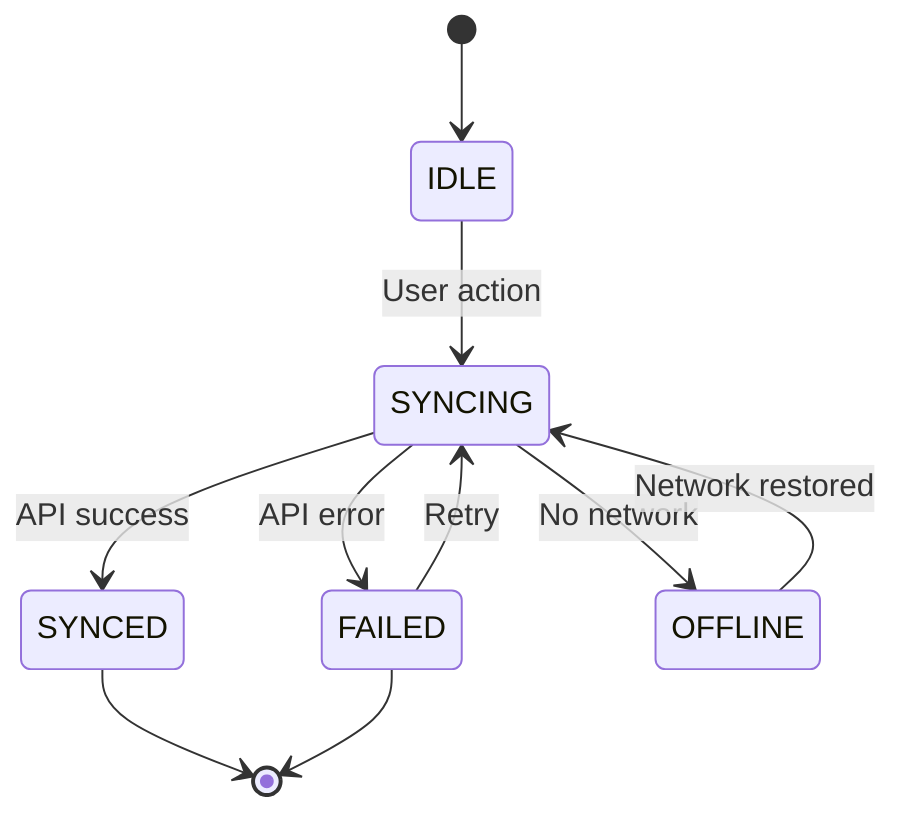

# Workflow: Technical Deep Dive

## Purpose

Explore specific technical domains in detail to resolve gaps before moving into implementation work. This is a **focused, collaborative** workflow designed for situations where the architecture discovery phase revealed unresolved questions or where the feasibility of implementation hinges on technical clarity.

**Core Principles:**
- **Focused, not exhaustive** - Dive only where ambiguity blocks progress
- **Collaborative** - Establish with stakeholders what requires depth and what can remain high-level
- **Outcome-driven** - Center on unblocking implementation rather than building documentation as an end goal
- **Flexible** - Easily extend depth or adjust course based on team input

## When to Use This Workflow

**Begin after** architecture discovery has been completed and signed off.

**Employ when:**
- Discovery phase left unanswered questions that impact feasibility
- Complex third-party or cross-system integrations require precise contract specifications
- Error handling logic or state transitions require explicit definition
- Scalability or performance constraints demand validation or resource budgeting
- Implementation confidence depends on deeper technical clarity in specific areas

**Avoid when:**
- Architecture choices themselves are still in flux (use collaborative-architecture-discovery instead)
- Technical details can be resolved organically during development
- The goal is documentation expansion rather than implementation de-risking

**Mobile development contexts where this workflow is particularly useful:**
- API client work depends on exact request/response structure definitions
- Offline-first or data-sync approaches need explicit state machine specification
- Third-party library or framework integration requires setup and configuration mapping
- Cross-platform implementations need feature and capability alignment
- App responsiveness depends on latency budgets or memory constraints

## Inputs

- Finished architecture discovery materials (decision matrix, component breakdown, architecture delta)
- Identified technical areas requiring deeper exploration

## Artifact Storage

Store outputs in `./agents/ephemeral/{feature}-deep-dive/` (create directory if needed).
Organize by technical topic (e.g., `schema-contract.md`, `error-strategy.md`, `state-flow.md`).

---

## Workflow Steps

### Step 0 — Define Scope Collaboratively

**Pause and engage stakeholders** before starting detailed work.

Share the discovery artifacts and seek alignment on:
- "Which specific areas need higher resolution before implementation begins?"
- "What technical uncertainties are preventing progress?"
- "Are there questions from discovery that we should resolve now?"
- "Which areas can we defer until development without blocking progress?"

**Then** establish clear boundaries:
- Identify 2-5 specific topics for deeper investigation
- For each topic, clarify the outcome needed (what understanding or decision)
- Mark what remains out of scope (what we're addressing later)

**Deliverable:** Scoping conversation or document confirming focus areas

**Gate:** [ ] Team has named specific areas needing deeper investigation

---

### Step 1 — Gather Background

For each focus area, collect relevant background:
- What insights did discovery provide about this area?
- What gaps or assumptions were noted?
- What patterns or implementations exist in the current codebase?
- What external systems or specifications are relevant?

**Approach:**
- Search codebase for similar implementations or patterns
- Review discovery materials for related findings
- Locate external references (API documentation, SDK specs, format definitions)

**Deliverable:** Background summary (conversational or concise reference doc)

**Gate:** [ ] Key context gathered; [ ] Gaps identified

---

### Step 2 — Develop Technical Approach

For each focus area, outline a concrete approach:
- Present 1-2 alternative approaches if significant tradeoffs exist
- Illustrate with real examples: JSON schemas, flow diagrams, classification tables, and data models
- Make visible which decisions are fixed versus which have flexibility
- Name implications and downstream effects

**Engage stakeholders** before locking in:
- "Does this direction address the concern?"
- "What edge cases or scenarios might I be overlooking?"
- "Would you prefer a different approach?"

**Deliverable:** Focused, standalone document per topic

**Gate:** [ ] Approach articulated; [ ] Stakeholder feedback incorporated

---

### Step 3 — Formalize Technical Decisions

For each focus area, produce documentation of decisions:
- **Schema/Contract:** Complete data structure, field types, constraints
- **Error Handling:** Error categories, response handling, recovery strategies
- **State Machine:** States, transitions, terminal states with rules
- **Sizing/Performance:** Capacity estimates, latency targets, scaling strategy
- **Integration Details:** Endpoints, required headers, authentication flow, idempotency approach

**Format:** Choose the format that most clearly communicates the decision (tables for taxonomies, diagrams for workflows, structured data for contracts, narrative for reasoning)

**Keep focused:**
- Provide sufficient detail for confident implementation
- Omit ceremonial or decorative elements
- Use schemas, tables, and diagrams to show relationships and constraints

**Deliverable:** Polished technical documents (one per topic)

**Gate:** [ ] Decisions captured; [ ] Team ready to implement

---

### Step 4 — Refresh Discovery Materials (If Applicable)

If deeper investigation resolves open questions:
- Revise component list to reflect new insights
- Add or update configuration requirements
- Update the architecture delta if file structure changed

**Deliverable:** Updated discovery materials (as needed)

**Gate:** [ ] Discovery materials reflect current understanding

---

## Expected Outputs

**Typical scope: 2-5 technical documents**

Sample naming:
- `./agents/ephemeral/{feature}-deep-dive/data-contract.md`
- `./agents/ephemeral/{feature}-deep-dive/data-model.md`
- `./agents/ephemeral/{feature}-deep-dive/failure-modes.md`
- `./agents/ephemeral/{feature}-deep-dive/sync-workflow.md`
- `./agents/ephemeral/{feature}-deep-dive/service-integration.md`

---

## Template Guidance

The templates provided below use JSON notation for data structure definition. This notation represents **contract specifications** and **data structure blueprints**, not executable code. Emphasize:
- Data element definitions and structure
- Validation requirements and data constraints
- Transition rules and state classifications
- Service interfaces and API contracts

---

## Templates

### Scope Document

```markdown
# Technical Deep Dive Scope: {Feature Name}

## Goal

{What we're aiming to clarify or reduce risk on}

## Investigation Areas

1. **{Topic}** - {Importance or blocker this addresses}
2. **{Topic}** - {Importance or blocker this addresses}
3. **{Topic}** - {Importance or blocker this addresses}

## Not Included

- {What we'll explore later}
- {What will emerge during development}

## Definition of Done

- [ ] {Specific question resolved}
- [ ] {Specific choice locked in}
- [ ] {Specific risk eliminated}
```

### API Response Schema / Data Model

```markdown
# Data Contract: {Endpoint or Component Name}

## Background

{Why this contract is important, which system produces or consumes it}

## Structure Definition

Express the data contract using structured notation:

```json
{
  "id": "string (UUID)",
  "userId": "string",
  "timestamp": "string (ISO 8601)",
  "correlationId": "string (UUID, optional)",
  "data": {
    "resourceId": "string",
    "status": "string",
    "attributes": {}
  }
}
```

This defines the **data contract**, not implementation code.

## Field Reference

| Field | Type | Mandatory | Purpose | Constraints |
|-------|------|-----------|---------|-------------|
| id | string | Yes | Unique identifier | UUID format |
| userId | string | Yes | Subject identifier | Non-empty string |
| timestamp | string | Yes | Creation or server time | ISO 8601 format |
| correlationId | string | No | Request tracing identifier | UUID format if provided |
| data | object | Yes | Domain-specific payload | Schema-compliant |
| ... | ... | ... | ... | ... |

## Sample Responses

**Standard Case:**
```json
{example}
```

**Edge Case:**
```json
{example}
```

## Unresolved Items

- {Question or gap}

## Choices Made

- {Decision recorded}
```

### Error Handling

```markdown
# Error Handling Strategy: {Feature Name}

## Overview

{Which error scenarios we manage, importance of each}

## Error Taxonomy

| Category | Instance | Handler | Retry? | Instrumentation |
|----------|----------|---------|--------|-----------------|
| Validation | Invalid response format | User notification | No | api.errors.validation |
| Network | Connection unavailable | Queue or backoff | Yes | api.errors.network |
| Server Issues | API 5XX | Exponential backoff | Yes | api.errors.server |
| Client Issues | API 4XX | Logging and alert | No | api.errors.client |
| Timeout | Request exceeded duration | Backoff with extension | Yes | api.errors.timeout |

## Retry Behavior

**Retry-Safe Errors:**
- API 5XX, 429 status codes
- Network disconnection or timeouts
- DNS failures
- Transient SSL/TLS failures

**Non-Retry Errors:**
- Request validation failures
- API 4XX (except 429)
- Auth failures (401, 403)
- Missing resources (404)

**Retry Mechanics:**
- Attempts allowed: 3
- Backoff strategy: Exponential (1s, 2s, 4s)
- Dead-letter queue on exhaustion

## Failure Scenarios

| Situation | Expected Behavior | Remediation |
|-----------|-------------------|-------------|
| {Situation} | {Observable effect} | {Recovery path} |

## Design Decisions

- {Decision about handling}
```

### State Machine

```markdown
# State Flow: {Feature Name}

## Overview

{Which states we model, why state management is critical}

## State Diagram



## State Catalog

| State | Definition | Terminal? | Allowed Transitions |
|-------|------------|-----------|-------------------|
| IDLE | No ongoing sync | No | SYNCING |
| SYNCING | API call in progress | No | SYNCED, FAILED, OFFLINE |
| SYNCED | Data reconciliation complete | Yes | - |
| FAILED | Sync ended with error | Yes | - |
| OFFLINE | Network unavailable | No | SYNCING |

## Transition Specification

| Current | Next | Trigger Event | Guard Condition |
|---------|------|---------------|-----------------|
| IDLE | SYNCING | User initiates | Network available |
| SYNCING | SYNCED | API returns 200 | Response validates |
| SYNCING | FAILED | API returns 4XX | Error is non-retryable |
| SYNCING | OFFLINE | Network lost | - |
| OFFLINE | SYNCING | Network returns | Auto-retry active |

## Design Choices

- {Decision recorded}
```

### Integration Details

```markdown
# Service Integration: {Service or System Name}

## Overview

{Which external service we depend on, integration purpose}

## API Operations

### Operation 1: {Name}

**Endpoint:** `GET /api/v1/users/{userId}/profile`

**Required Headers:**
- `Authorization: Bearer {accessToken}`
- `X-Request-ID: {requestId}`
- `Content-Type: application/json`

**Response Contract:**
```json
{
  "id": "string",
  "username": "string",
  "profile": {
    "displayName": "string",
    "avatarUrl": "string (URL, optional)"
  }
}
```

This specifies the expected response structure.

**Error Responses:**
- 401: Refresh token and retry (once)
- 404: Display empty-state UI
- 5XX: Backoff retry (3 attempts)
- Timeout: Retry with extended timeout

### Operation 2: {Name}

{Same template}

## Authorization & Credentials

- OAuth2 authorization code grant with PKCE
- Required permissions: `user:read`, `user:write`
- Credential storage: System keychain {iOS: Keychain / Android: KeyStore}
- Token refresh: Auto-renew on 401

## Request Idempotency

- Write operations include `X-Idempotency-Key: {uuid}` header
- Key generation: Derived from request payload or unique UUID
- Server deduplication window: 24 hours

## Design Choices

- {Decision documented}
```

### Sizing/Performance

```markdown
# Capacity & Performance: {Feature Name}

## Overview

{What needs sizing, performance impact}

## Capacity Estimates

| Metric | Value | Basis |
|--------|-------|-------|
| Daily active users | 50,000 | Analytics |
| API requests/day | 500,000 | ~10/user/day |
| Peak requests/hour | 100,000 | Evening peak (6-8pm) |
| Baseline API latency | 200ms | Backend SLA |
| p99 API latency | 1s | With retries |
| Per-user storage | 50MB | Local cache |

## Performance Goals

**Service Latencies:**
- p50: < 200ms
- p95: < 500ms
- p99: < 1s

**Application Metrics:**
- Cold startup: < 2s
- View transitions: < 100ms
- Local lookups: < 50ms
- Sync operation: < 30s

## Latency Breakdown

| Component | Allocation | Measured (est) |
|-----------|-----------|--------|
| Network transit | 100ms | 50ms (WiFi), 150ms (LTE) |
| Backend processing | 200ms | 100ms |
| Parsing | 50ms | 20ms |
| Storage write | 50ms | 30ms |
| Rendering | 100ms | 16ms (60fps) |
| **Total Time** | **500ms** | **~250ms** |

## Performance Risks

- {Potential constraint}
- {Mitigation strategy}

## Design Decisions

- {Decision recorded}
```

---

## Guardrails

### Knowing When You're Done

Conclude detailed investigation when:
- The team can begin implementation with confidence
- Remaining issues are resolvable through development
- Additional documentation offers diminishing returns

### What Not to Do

- Avoid prescribing the full implementation (let developers own design decisions)
- Avoid producing comprehensive test specifications (those belong in implementation)
- Avoid drilling into implementation minutiae (focus on external contracts, boundaries)
- Avoid repeating information from discovery documents

### Engagement Points

- During scoping: "Are we investigating the right areas?"
- During research: "Am I examining the relevant aspects?"
- During proposal: "Is this approach sound?"
- During finalization: "Does this provide sufficient clarity?"

---

## Interaction Pattern

### Sample Exchange:

**Agent:** "Discovery surfaced some unresolved questions about the API response schema and offline-first behavior. Which of these areas need deeper investigation before implementation?"

**User:** "I need clarity on the exact API response structure for the user profile endpoint, and how we handle offline sync when cached data becomes stale."

**Agent:** "Understood. For the API contract, should we build against the current v1 API or target the upcoming v2? On offline sync, are the key concerns around data freshness thresholds, or conflict resolution when data diverges?"

**User:** {provides additional context}

**Agent:** {researches codebase patterns, reviews requirements}

**Agent:** "I'm proposing an API schema with versioning and cache timestamping... For offline sync, I'm suggesting a last-write-wins approach with a 24-hour data freshness boundary. Does that address your needs?"

**User:** {shares feedback or refinements}

**Agent:** {refines proposal or transitions to next investigation area}

