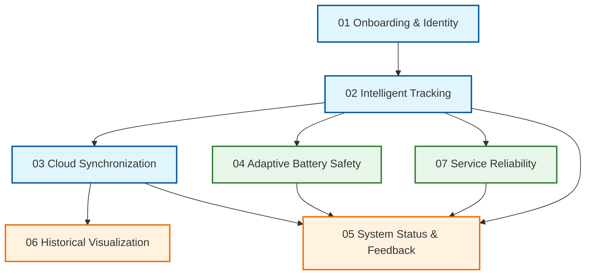

# Behavioral Specifications

This directory contains the behavioral specifications for the Locus system, written in the **EARS** (Easy Approach to Requirements Syntax) format.

These specifications are organized by **Feature Bounded Context** and are listed below in their logical dependency order. This order dictates the implementation sequence: upstream dependencies (like Data Production) must be defined before downstream consumers (like Visualization).

## Dependency Graph

## Dependency Descriptions

### 1. [Onboarding & Identity](01_onboarding_identity.md)
*   **Role:** User Context & Security.
*   **Dependency:** Fundamental. The system cannot operate without the cryptographic identity and storage resources established here.

### 2. [Intelligent Tracking](02_intelligent_tracking.md)
*   **Role:** Data Producer.
*   **Dependency:** Requires Identity (to know *who* is tracking).
*   **Logic:** Generates the location data that drives all other features.

### 3. [Cloud Synchronization](03_cloud_synchronization.md)
*   **Role:** Data Transport.
*   **Dependency:** Requires Tracking (data to sync) and Identity (credentials to upload).
*   **Logic:** Moves data from the local buffer to the remote persistence layer.

### 4. [Adaptive Battery Safety](04_adaptive_battery_safety.md)
*   **Role:** Constraint Layer.
*   **Dependency:** Governs Tracking and Synchronization.
*   **Logic:** Overrides standard behaviors of the producer and transport layers based on resource availability.
*   **Parallelism:** Can be implemented in parallel with **Synchronization** or **Reliability** once Tracking is established.

### 5. [System Status & Feedback](05_system_status_feedback.md)
*   **Role:** User Interface State.
*   **Dependency:** Aggregates states from Tracking, Sync, and Battery.
*   **Logic:** Maps internal system states to user-facing indicators (Notifications, Dashboard).

### 6. [Historical Visualization](06_historical_visualization.md)
*   **Role:** Data Consumer.
*   **Dependency:** Requires Synchronization (remote data availability).
*   **Logic:** Retrieves and presents the data stored by the system.

### 7. [Service Reliability](07_service_reliability.md)
*   **Role:** Supervisor.
*   **Dependency:** Monitors the runtime health of all prior components.
*   **Logic:** Ensures the continuous operation of the defined system behaviors.
*   **Parallelism:** Can be implemented in parallel with **Synchronization** or **Battery Safety** once Tracking is established.
