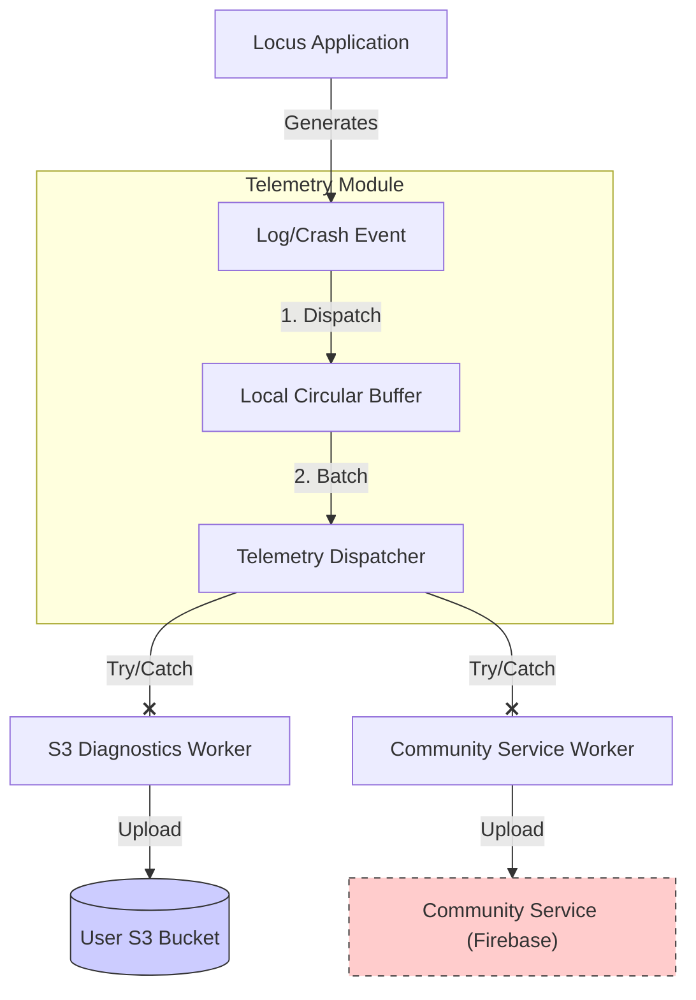

# Runtime Telemetry & Resilience

This document defines the architecture for runtime observability (logging, crash reporting, health metrics) while strictly adhering to the "User-Owned" and "Privacy-First" principles.

## 1. Core Principles

*   **Fail-Open Design:** The application **shall** continue normal operation (tracking, storing data) even if the telemetry subsystems fail completely (e.g., network unreachable, crash in logger).
*   **Data Sovereignty:** The user's S3 bucket is the **Primary Destination** for all diagnostic data.
*   **Privacy-First Compilation:** The application uses Build Variants to physically exclude proprietary tracking code from FOSS builds.
*   **Voluntary Contribution:** Reporting to a centralized "Community" service is strictly **Opt-In** and **Secondary**.

## 2. Architecture

The telemetry system utilizes a "Dual-Dispatch" model with strict isolation and build-time configuration.


*Note: The above diagram can be rendered using any Markdown editor with Mermaid support.*

### 2.1. Build Variants (Flavors)

To respect user privacy and FOSS principles, the application **shall** be compiled in two flavors:

1.  **Standard (`standard`):**
    *   **Includes:** Firebase Crashlytics (and Google Play Services dependencies).
    *   **Purpose:** Development, Beta Testing, Google Play Store distribution.
    *   **Behavior:** Community telemetry is possible (if opted-in).
2.  **FOSS (`foss`):**
    *   **Excludes:** All proprietary libraries (Firebase, GMS).
    *   **Purpose:** F-Droid, privacy-conscious manual installs.
    *   **Behavior:** The `Community Service Worker` is a "No-Op" stub. Community telemetry settings are hidden or disabled.

## 3. Destinations

### 3.1. Primary: User S3 (Diagnostics)
*   **Purpose:** Full fidelity debugging, crash dumps, and performance metrics.
*   **Path:** `s3://<user-bucket>/diagnostics/YYYY/MM/DD/<device_id>_<timestamp>.ndjson.gz`
*   **Retention:** Controlled by S3 Lifecycle Policy (Strict **30 Days**).
*   **Format:** NDJSON (Newline Delimited JSON) for machine parseability.

#### Log Schema (NDJSON)
Each line in the log file **must** adhere to the following schema:
```json
{
  "ts": "2023-10-27T10:00:00.123Z",  // ISO 8601 Timestamp
  "lvl": "WARN",                     // INFO, WARN, ERROR, FATAL
  "tag": "TrackerService",           // Component Name
  "msg": "GPS signal lost for 30s",  // Human-readable message
  "ctx": {                           // Environmental Context
    "bat": 85,                       // Battery Level %
    "chg": false,                    // Is Charging?
    "net": "wifi",                   // Network Type (wifi, cell, none)
    "perm": true,                    // Is Location Permission Granted?
    "svc": true                      // Is Tracker Service Running?
  },
  "stack": "..."                     // Optional: Stack Trace for Errors
}
```

### 3.2. Secondary: Community Service (Opt-In)
*   **Service:** Firebase Crashlytics (via `FirebaseTelemetryRemote`).
*   **Mechanism:** Native SDK integration (Standard Flavor only).
*   **Schema:** Defined implicitly by the Firebase Crashlytics platform (Stacks, Keys, User IDs). No custom JSON schema is required at this stage.
*   **Privacy Strategy:** "Salted Anonymity"
    *   **The Risk:** Linking a crash report (containing app state) to a public track file (containing `device_id`).
    *   **The Solution:** The app generates a random UUID (`telemetry_salt`) at install time, stored in `EncryptedSharedPreferences`.
    *   **The ID:** The ID sent to Firebase is `SHA256(device_id + telemetry_salt)`.
    *   **Result:** Developers can correlate crashes from the same device *without* knowing which User S3 bucket or real-world identity it belongs to.

## 4. Resilience & Fail-Open Requirements

To ensure the "Fail-Open" mandate:

1.  **Isolation:** Telemetry operations **must** run in isolated Coroutine scopes (e.g., `Dispatchers.IO`) wrapped in top-level `try-catch` blocks.
    *   **Requirement:** A crash in the logging subsystem **must never** propagate to the calling thread (e.g., the tracking loop).
    *   **Buffer Safety:** The *Local Circular Buffer* shall use a low-level, robust implementation (e.g., `mmap` or file-append) to maximize the chance of persisting logs even during a process crash (Tombstone support[^1]).

[^1]: **Tombstone Support:** The ability to read the final log buffer state from disk even after the application process has completely died/crashed (e.g., due to an OS kill or unhandled exception).

2.  **Exception Swallowing (Best Effort Retry):**
    *   **IF** a telemetry upload fails, **THEN** the system **shall** catch the exception and abort the **current attempt**.
    *   **The system shall not** retry immediately (to preserve battery).
    *   **Implicit Retry:** The failed logs **remain in the Local Circular Buffer**. They will naturally be included in the **next scheduled upload batch**, provided they have not been evicted by newer logs (FIFO).
    *   **Trade-off:** This prioritizes battery life over guaranteed delivery. If the buffer overflows before the next successful sync, old logs are dropped.

3.  **Dual Cursor Partial Success Strategy:**
    To maximize data retention without blocking the primary flow, the Local Circular Buffer must implement a **Dual Cursor** architecture.
    *   **Independent Pointers:**
        *   `Cursor_S3`: Tracks the offset successfully uploaded to the User's S3 bucket.
        *   `Cursor_Community`: Tracks the offset successfully uploaded to the Community Service (if enabled).
    *   **Non-Blocking Progress:**
        *   The S3 Worker reads from `Cursor_S3` and advances it upon success. It does **not** wait for `Cursor_Community`.
        *   This ensures that failures in the optional Community upload (e.g., Firebase down) **never** delay the primary S3 backup.
    *   **Lazy Deletion:**
        *   Physical deletion of data from the disk buffer occurs only up to the **minimum** of the two cursors: `min(Cursor_S3, Cursor_Community)`.
        *   This allows the Community Worker to "catch up" later without data loss.
    *   **Safety Valve (Storage Limit):**
        *   **Constraint:** The buffer has a hard size limit (e.g., 5MB).
        *   **Override:** If the buffer hits this limit, the system **must force-overwrite** the oldest data, even if `Cursor_Community` (or `Cursor_S3`) has not yet processed it.
        *   **Rationale:** This preserves the "Fail-Open" principle—the app must never crash or stop tracking due to a full disk, even if it means losing some diagnostic history.

4.  **Circuit Breaking:**
    *   **IF** telemetry uploads fail consecutively for > 5 attempts, **THEN** the Telemetry Module **shall** enter a "Backoff" state for 6 hours.

## 5. Implementation Definition

### 5.1. Local Debug Dashboard
Since S3 logs are remote and compressed, the app **shall** provide a local "Debug View" for immediate troubleshooting:
*   **Source:** Reads from the *Local Circular Buffer* (in-memory or short-term file).
*   **Features:**
    *   Scrollable list of recent logs (last ~500 lines).
    *   Color-coded by level (WARN/ERROR).
    *   "Copy to Clipboard" / "Share" button for manual reporting.

### 5.2. Configuration
*   `enable_community_telemetry`: Boolean (Default: `false`). Only visible/effective in `Standard` build.
*   `enable_s3_diagnostics`: Boolean (Default: `true`).
*   `telemetry_salt`: String (UUID). Generated once on first run.
