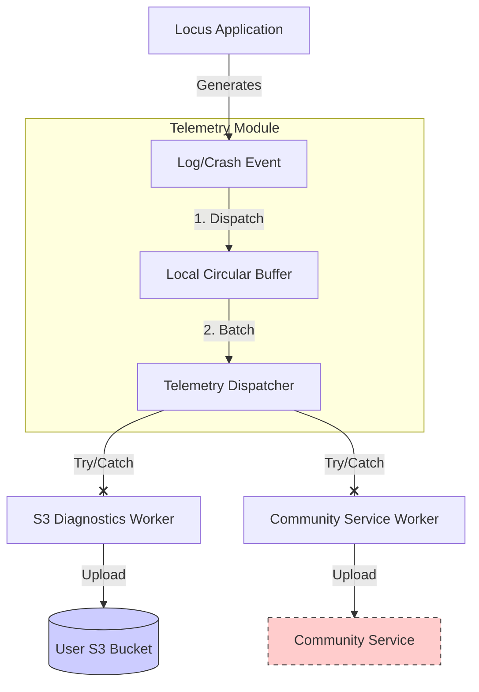

# Runtime Telemetry & Resilience

This document defines the architecture for runtime observability (logging, crash reporting, health metrics) while strictly adhering to the "User-Owned" and "Privacy-First" principles.

## 1. Core Principles

*   **Fail-Open Design:** The application **shall** continue normal operation (tracking, storing data) even if the telemetry subsystems fail completely (e.g., network unreachable, crash in logger).
*   **Data Sovereignty:** The user's S3 bucket is the **Primary Destination** for all diagnostic data.
*   **Voluntary Contribution:** Reporting to a centralized "Community" service is strictly **Opt-In** and **Secondary**.

## 2. Architecture

The telemetry system utilizes a "Dual-Dispatch" model with strict isolation.

## 3. Destinations

### 3.1. Primary: User S3 (Diagnostics)
*   **Purpose:** Full fidelity debugging, crash dumps (tombstones), and performance metrics.
*   **Path:** `s3://<user-bucket>/diagnostics/YYYY/MM/DD/<device_id>_<timestamp>.log.gz`
*   **Retention:** Controlled by the S3 Lifecycle Policy (default: 30 days, distinct from Tracks).
*   **Content:** Full stack traces, device state, strict internal logs.

### 3.2. Secondary: Community Service (Opt-In)
*   **Purpose:** Aggregate health monitoring (e.g., "Is version 1.2.0 crashing more?").
*   **Mechanism:** REST API (e.g., Kinesis Firehose or simple Endpoint).
*   **Privacy Filtering:**
    *   **The system shall** remove all PII (Personal Identifiable Information) before transmission.
    *   **The system shall** exclude raw location coordinates.
    *   **The system shall** anonymize the `device_id` (e.g., using a hashed salt).

## 4. Resilience & Fail-Open Requirements

To ensure the "Fail-Open" mandate:

1.  **Isolation:** Telemetry operations **must** run in isolated Coroutine scopes (e.g., `Dispatchers.IO`) separate from the critical Tracking Loop.
2.  **Exception Swallowing:**
    *   **IF** a telemetry upload fails (S3 or Community), **THEN** the system **shall** catch the exception, log it to the *Local Circular Buffer* (if possible), and discard the payload.
    *   **The system shall not** retry telemetry uploads more than once to prevent battery drain.
3.  **Circuit Breaking:**
    *   **IF** telemetry uploads fail consecutively for > 5 attempts, **THEN** the Telemetry Module **shall** enter a "Backoff" state for 6 hours.

## 5. Implementation Definition

*   **Local Circular Buffer:** A small, in-memory (or file-backed) ring buffer to store the last N logs. This ensures that even if uploads fail, the user can inspect the immediate history via the "Debug" screen.
*   **Configuration:**
    *   A boolean setting `enable_community_telemetry` (Default: `false`).
    *   A boolean setting `enable_s3_diagnostics` (Default: `true`).
