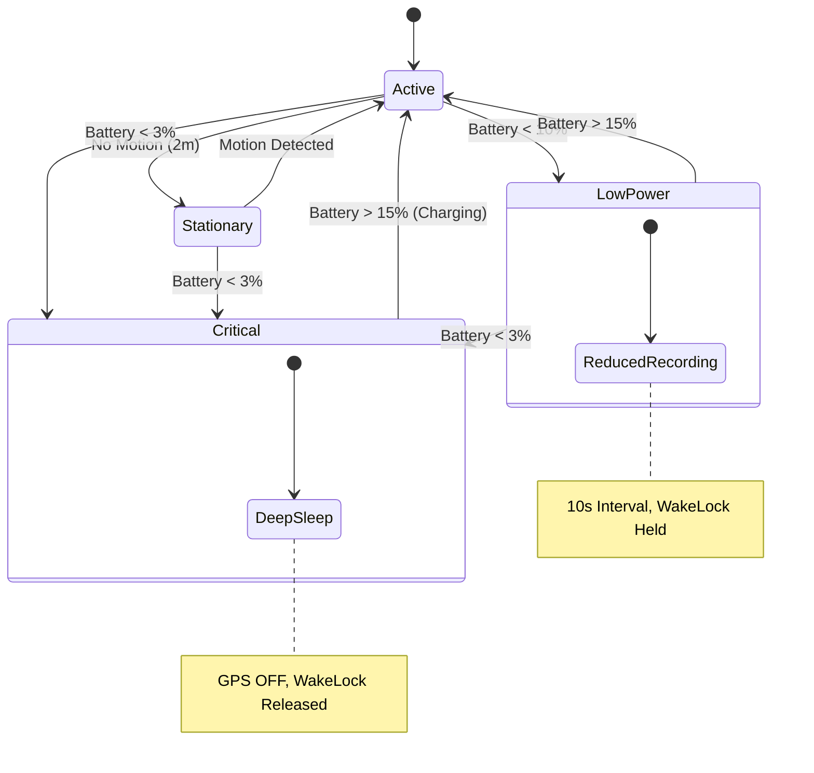

# Background Processing Specification (Phase 3)

**Status:** Draft
**Related Requirements:** [Data Collection](../requirements/data_collection.md), [Data Storage](../requirements/data_storage.md), [Android Architecture](../android_architecture.md)

This document details the technical implementation of the Android Services, Workers, and State Machines that power the "Always On" nature of the application.

## 1. Foreground Service Strategy

The core data collection engine is the `TrackerService`.

*   **Type:** `ForegroundService` with `type="location"`.
*   **Sticky:** `START_STICKY` is used to allow the OS to automatically restart the service if killed due to memory pressure.
*   **Binding:** **None.** The service uses a "Fire and Forget" pattern. Communication to the UI is handled via the Domain Layer (Repositories/Flows), and commands from the UI are sent via standard `Intents` (`startService`, `stopService`).
*   **Wake Lock:**
    *   **Type:** `PARTIAL_WAKE_LOCK`.
    *   **Behavior:** Held continuously while in the **Active Tracking** state. Released when entering **Stationary (Deep Sleep)** state to allow the CPU to sleep.

### 1.1. Lifecycle Methods
*   `onStartCommand()`:
    1.  Acquire/Verify WakeLock.
    2.  Check `StartTrackingUseCase` (Permissions/Battery).
    3.  If valid, transition to `Tracking` state.
    4.  Register `StationaryManager` and `BatteryState` observers.
    5.  Return `START_STICKY`.
*   `onDestroy()`:
    1.  Release WakeLock.
    2.  Unregister all observers.
    3.  Stop Location Updates.
    4.  Cancel "Passive Heartbeat" Alarm.

### 1.2. Notification Channels
To separate "Background Status" from "Critical Alerts", two channels are defined:

1.  **Tracking Status (`channel_tracking`)**
    *   **Importance:** `LOW` (Silent, Minimized).
    *   **Usage:** The persistent notification required for the Foreground Service.
    *   **Content:** "Recording • GPS: 3m • Buffer: 120 pts".
2.  **Critical Alerts (`channel_alerts`)**
    *   **Importance:** `HIGH` (Sound + Vibration).
    *   **Usage:** Fatal Errors (e.g., "Location Permission Revoked", "Tracking Failed").
    *   **Bypass:** Triggers even if the app is in "Subtle Mode" (unless system DND is on).

## 2. State Machine & Precedence

The service behavior is governed by the intersection of **Motion State** and **System State (Battery)**.

### 2.1. States

| State | Description | GPS | WakeLock | Triggers |
| :--- | :--- | :--- | :--- | :--- |
| **Active** | Default moving state. | ON (1Hz) | HELD | Movement detected. |
| **Stationary** | Device is still. | OFF | RELEASED | No movement for 2 mins. |
| **Low Power** | Battery < 10%. | Reduced (10s) | HELD* | Battery falls below 10%. |
| **Critical** | Battery < 3%. | OFF | RELEASED | Battery falls below 3%. |

*\*Rationale: In "Low Power" mode (10s interval), holding the WakeLock prevents "CPU Thrashing" (suspending and waking every 10 seconds), which would consume more energy than staying awake.*

### 2.2. State Diagram

### 2.3. Precedence Rules

1.  **Critical Battery Overrides All:** If Battery < 3%, the system enforces the "Deep Sleep" state (GPS OFF, WakeLock RELEASED) to prevent total shutdown.
    *   *Mechanism:* Active tracking stops. "Periodic Burst" checks (FOSS) are disabled. We rely solely on hardware interrupts (`TYPE_SIGNIFICANT_MOTION`) or user intervention (Charging).
2.  **Stationary Overrides Active:** If `Stationary` is detected, GPS is suspended.
3.  **Manual Override:** A "Manual Sync" or "Test Mode" temporarily overrides Low Power constraints.

## 3. Component Specifications

### 3.1. StationaryManager
Encapsulates the logic for detecting when the device is still.

*   **Interface:** `StationaryManager`
    *   `fun startMonitoring()`
    *   `fun stopMonitoring()`
    *   `val isStationary: Flow<Boolean>`
*   **Implementations (Injected via Hilt):**
    *   **Standard (`FusedStationaryManager`):** Uses Google Play Services `ActivityRecognitionClient` (Transition API: `STILL` vs `WALKING/VEHICLE`).
    *   **FOSS (`SensorStationaryManager`):**
        *   **Primary:** `Sensor.TYPE_SIGNIFICANT_MOTION` (One-shot hardware interrupt).
        *   **Fallback:** "Periodic Burst" (AlarmManager wakes every 5 mins -> Sample Accel @ 10Hz for 5s -> Analyze Variance).

### 3.2. Watchdog (Reliability Layer)
Ensures the `TrackerService` remains alive.

*   **Mechanism:** `WorkManager` (Periodic, 15 minutes).
*   **Heartbeat Contract:**
    *   `TrackerService` writes `last_heartbeat_ts` to `EncryptedSharedPreferences` once per hour (via `AlarmManager`).
    *   *Note:* Heartbeat continues even in Stationary Mode (Service wakes briefly to write).
*   **Logic (`CheckServiceHealthUseCase`):**
    1.  Check `isServiceRunning(TrackerService)`.
    2.  Read `last_heartbeat_ts`.
    3.  **Zombie Detection:** If `Running` BUT `ts > 90 mins ago`:
        *   Log "Zombie Detected".
        *   Call `stopService()` (Kill process).
        *   Attempt Restart (see below).
    4.  **Dead Detection:** If `Not Running`:
        *   Log "Service Dead".
        *   Attempt Restart (see below).
    5.  **Circuit Breaker:** If restart fails 3 times consecutively, post `Fatal Error` notification.

    **Android 12+ (SDK 31) Compliance:**
    *   **Restriction:** Android 12 restricts apps from starting Foreground Services while running in the background (e.g., from a WorkManager job) to prevent "surprise" battery drain by silent services. Doing so throws a `ForegroundServiceStartNotAllowedException`.
    *   **Alternatives Considered:**
        *   *Exemption via Exact Alarm:* We could use `AlarmManager` with `SCHEDULE_EXACT_ALARM` to trigger the restart, which grants a temporary exemption. However, this permission requires strict Play Store justification and is intended for time-critical events (alarms/timers), not service restarts.
        *   *User Interaction (Chosen):* The safest, most policy-compliant method is to ask the user to resume.
    *   **Strategy:**
        1.  Attempt `startForegroundService()`.
        2.  Catch `ForegroundServiceStartNotAllowedException` (or check SDK version).
        3.  **Fallback:** Post a **High Priority Notification** ("Tracking Paused Unexpectedly") with a `PendingIntent` that restarts the service when tapped by the user.

## 4. Background Workers (WorkManager)

### 4.1. SyncWorker
Handles data upload.

*   **Type:** `CoroutineWorker`.
*   **Schedule:** Periodic (15 minutes).
*   **Constraints:**
    *   `NetworkType`: **CONNECTED** (Metered is OK).
    *   `BatteryNotLow`: **TRUE** (Auto-pauses if < 10%).
    *   `RequiresCharging`: **FALSE**.
*   **Logic:**
    *   Executes `PerformSyncUseCase(REGULAR)`.
    *   *Note:* Must handle `Sync` (S3) and `Telemetry` (Community) in isolated `try/catch` blocks.

### 4.2. Manual Sync
Triggered by user.

*   **Type:** `OneTimeWorkRequest` (uses same `SyncWorker` class).
*   **Policy:** `EXPEDITED`.
*   **Input Data:** `inputData = workDataOf("force" to true)`.
*   **Logic:**
    *   Worker detects "force" flag.
    *   Executes `PerformSyncUseCase(MANUAL)` (Ignores Battery constraints).

### 4.3. Boot & Update Receivers
Ensures "Always On" persistence.

*   **Triggers:** `BOOT_COMPLETED`, `MY_PACKAGE_REPLACED`.
*   **Logic:**
    1.  Check `AuthRepository.isIdentitySet()` (Don't start if not onboarding).
    2.  Call `startForegroundService()`.
