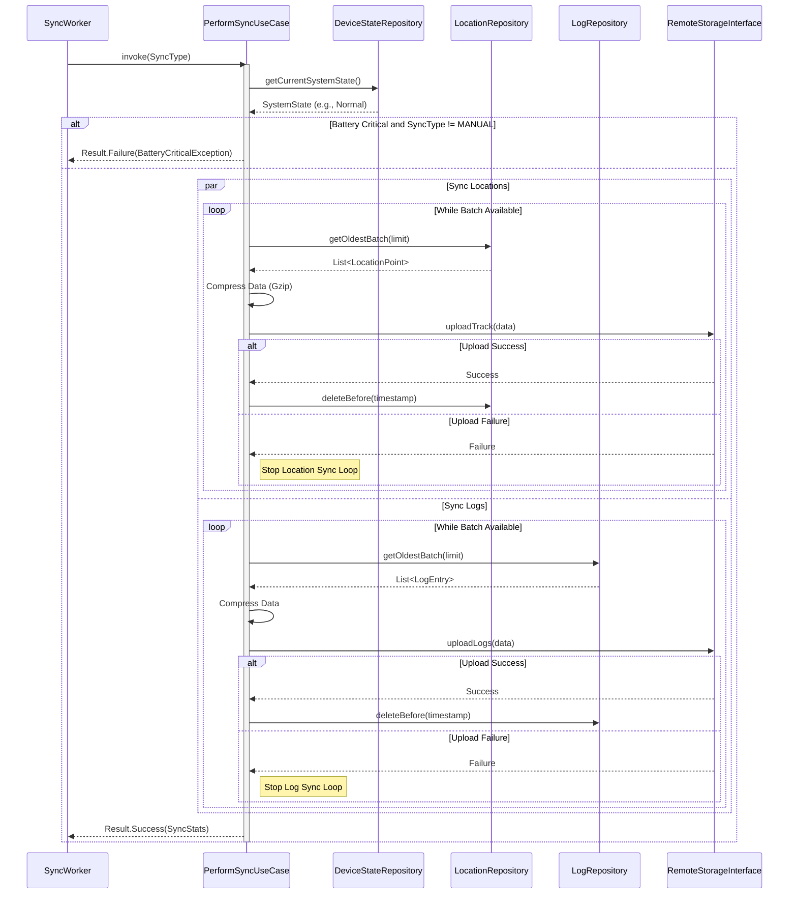
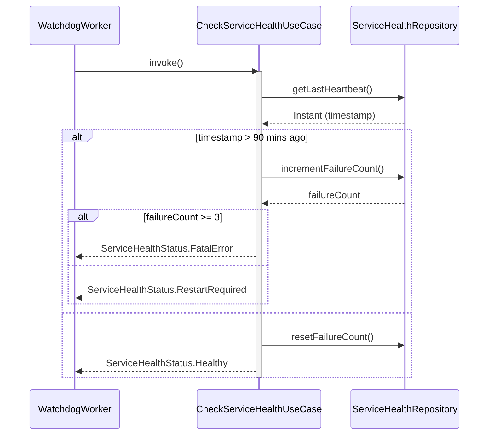
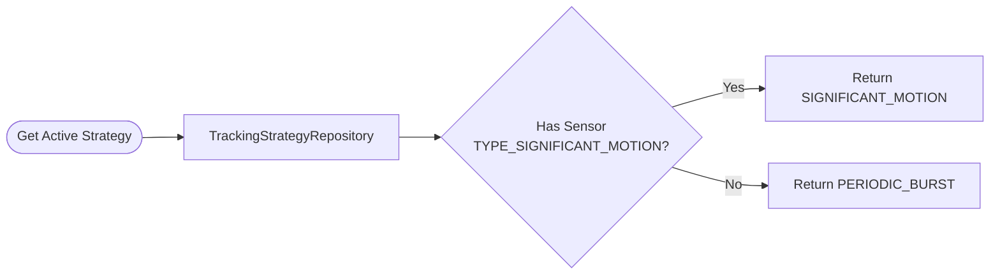
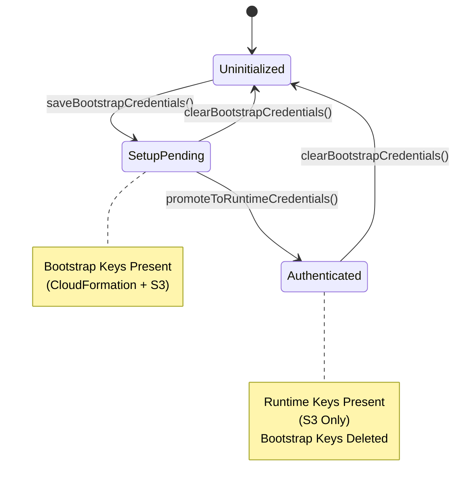

# Domain Layer Specification (Phase 2)

**Related Requirements:** [Process Definition](../process_implementation_definition.md), [Android Architecture](../android_architecture.md)

This document defines the business logic, state management, and data contracts for the Locus application, strictly separated from the Android Framework (UI/Services) and Data Layer (Room/Retrofit).

## 1. Architecture Principles

*   **Pure Kotlin:** The Domain Layer must be purely Kotlin code with **zero** dependencies on `android.*` (except generic types if absolutely necessary, but preferably none).
*   **Reactive:** Data streams are exposed as `Flow<T>`. One-shot operations (single request-response interactions) use `suspend` functions.
*   **Result Pattern:** All operations that can fail must return a sealed `Result<T>` wrapper, never throwing unchecked exceptions.
*   **Use Cases:** Complex logic involving multiple repositories or specific business rules is encapsulated in "Use Case" classes.

## 2. Domain Models

These models represent the "Truth" of the application. They are decoupled from Database Entities and API DTOs.

### 2.1. LocationPoint
Represents a single unified data point in time.

```kotlin
data class LocationPoint(
    val time: Instant,
    val coordinates: Coordinates,
    val speed: SpeedInfo,
    val battery: BatteryInfo,
    val network: NetworkContext,
    val sensors: SensorData?
)

data class Coordinates(
    val lat: Double,
    val lon: Double,
    val accuracy: Float,
    val altitude: Double
)

data class SpeedInfo(
    val speedMps: Float,
    val heading: Float // Derived or raw
)

data class BatteryInfo(
    val levelPercent: Int, // 0-100
    val isCharging: Boolean
)

data class NetworkContext(
    val cell: SignalStats?, // Level 0-4, dBm
    val wifi: SignalStats?
)

data class SignalStats(
    val level: Int,
    val dbm: Int
)

data class SensorData(
    val accel: Vector3?, // x, y, z
    val mag: Vector3?,
    val pressureHpa: Float?
)

data class Vector3(val x: Float, val y: Float, val z: Float)
```

### 2.2. LogEntry
Represents a diagnostic event.

```kotlin
data class LogEntry(
    val time: Instant,
    val level: LogLevel, // Enum: DEBUG, INFO, WARN, ERROR, FATAL
    val tag: String,
    val message: String,
    val context: LogContext // Battery, Net State at time of log
)

data class LogContext(
    val batteryLevel: Int,
    val networkState: String, // "WIFI", "CELL", "NONE"
    val metadata: Map<String, String>? // Flexible JSON storage
)
```

### 2.3. SystemState
Represents the current operational status of the device environment.

```kotlin
sealed class SystemState {
    object Normal : SystemState()
    data class LowBattery(val level: Int) : SystemState() // < 15%
    data class CriticalBattery(val level: Int) : SystemState() // < 3%
    object StorageFull : SystemState()
}
```

## 3. Repository Interfaces

Repositories define *what* data can be accessed, not *how*.

### 3.1. LocationRepository
Manages track data.

```kotlin
interface LocationRepository {
    // Write
    suspend fun recordPoint(point: LocationPoint): Result<Unit>

    // Read (Stream for UI)
    fun getPointsInTimeRange(start: Instant, end: Instant): Flow<List<LocationPoint>>

    // Read (One-shot for Sync)
    suspend fun getOldestBatch(limit: Int): Result<List<LocationPoint>>

    // Maintenance
    suspend fun deleteBefore(time: Instant): Result<Unit>
    suspend fun getBufferCount(): Result<Long>
}
```

### 3.2. LogRepository
Manages diagnostic logs.

```kotlin
interface LogRepository {
    suspend fun log(entry: LogEntry)
    suspend fun getOldestBatch(limit: Int): Result<List<LogEntry>>
    suspend fun deleteBefore(time: Instant): Result<Unit>
}
```

### 3.3. AuthRepository
Manages the complexity of "Bootstrap" vs. "Runtime" credentials.

```kotlin
interface AuthRepository {
    // State Check
    fun getAuthState(): Flow<AuthState> // Uninitialized -> Bootstrap -> Runtime

    // Actions
    suspend fun saveBootstrapCredentials(creds: BootstrapCredentials): Result<Unit>
    suspend fun promoteToRuntimeCredentials(creds: RuntimeCredentials): Result<Unit>
    suspend fun clearBootstrapCredentials(): Result<Unit>
    suspend fun getRuntimeCredentials(): Result<RuntimeCredentials>
}

sealed class AuthState {
    object Uninitialized : AuthState()
    object SetupPending : AuthState() // Has Bootstrap
    object Authenticated : AuthState() // Has Runtime
}
```

### 3.4. ConfigurationRepository
Manages app settings and unique identifiers.

```kotlin
interface ConfigurationRepository {
    val deviceId: String // Immutable after creation
    val telemetrySalt: String // Immutable

    suspend fun initializeIdentity(deviceId: String, salt: String): Result<Unit>
    fun isIdentitySet(): Boolean
}
```

### 3.5. DeviceStateRepository
Provides access to hardware status.

```kotlin
interface DeviceStateRepository {
    // Reactive stream for "Always On" service to observe
    val batteryState: Flow<SystemState>

    // One-shot for Workers
    suspend fun getCurrentSystemState(): SystemState

    // Connectivity
    fun getNetworkStatus(): Flow<NetworkStatus> // Connected/Disconnected/Metered
}
```

### 3.6. TrackingStrategyRepository
Determines the active tracking method based on hardware capabilities.

```kotlin
interface TrackingStrategyRepository {
    suspend fun getActiveStrategy(): TrackingStrategy
}

enum class TrackingStrategy {
    SIGNIFICANT_MOTION, // Hardware interrupt (Preferred)
    PERIODIC_BURST // Fallback
}
```

### 3.7. ServiceHealthRepository
Manages the Watchdog state.

```kotlin
interface ServiceHealthRepository {
    suspend fun recordHeartbeat()
    suspend fun getLastHeartbeat(): Instant?

    suspend fun incrementFailureCount(): Int // Returns new count
    suspend fun resetFailureCount()
    suspend fun getFailureCount(): Int
}
```

## 4. Use Cases (Interactors)

Encapsulates specific business rules.

### 4.1. PerformSyncUseCase
**Role:** Orchestrates the upload process (Location + Logs).
**Logic:**
1.  Check `DeviceState` (skip if Critical Battery, unless Manual Sync).
2.  Fetch `OldestBatch` from `LocationRepository`.
3.  Compress (Gzip).
4.  Upload to S3 (via Infrastructure Interface).
5.  If Success: `LocationRepository.deleteBefore()`.
6.  Repeat for Logs (Upload to S3 + Community).

```kotlin
class PerformSyncUseCase(
    private val locationRepo: LocationRepository,
    private val logRepo: LogRepository,
    private val remoteStore: RemoteStorageInterface, // Infrastructure layer
    private val deviceStateRepo: DeviceStateRepository
) {
    suspend operator fun invoke(type: SyncType): Result<SyncStats>
}

enum class SyncType {
    REGULAR, // Respects all battery constraints
    RESCUE, // Ignores low battery (up to critical limit)
    MANUAL // Overrides almost all checks
}
```

### 4.2. StartTrackingUseCase
**Role:** Initializes the tracking session.
**Logic:**
1.  Verify Permissions (Location, Notification).
2.  Check `DeviceState` (Battery).
3.  Determine `TrackingStrategy` via repository.
4.  Signal Service to start.

```kotlin
class StartTrackingUseCase(
    private val deviceStateRepo: DeviceStateRepository,
    private val strategyRepo: TrackingStrategyRepository
) {
    suspend operator fun invoke(): Result<Unit>
}
```

### 4.3. StopTrackingUseCase
**Role:** Cleanly ends the tracking session.

```kotlin
class StopTrackingUseCase {
    suspend operator fun invoke(): Result<Unit>
}
```

### 4.4. CheckServiceHealthUseCase
**Role:** Executed by the Watchdog Worker.
**Logic:**
1.  Get `LastHeartbeat`.
2.  If `Now - LastHeartbeat > 90 mins`:
    *   `failures = repo.incrementFailureCount()`
    *   If `failures >= 3`: Return `FatalError`.
    *   Else: Return `RestartRequired`.
3.  Else: Return `Healthy`.

```kotlin
class CheckServiceHealthUseCase(
    private val healthRepo: ServiceHealthRepository
) {
    suspend operator fun invoke(): ServiceHealthStatus
}

sealed class ServiceHealthStatus {
    object Healthy : ServiceHealthStatus()
    object RestartRequired : ServiceHealthStatus()
    object FatalError : ServiceHealthStatus() // Circuit Breaker tripped
}
```

## 5. Common Types

### 5.1. Result Pattern
```kotlin
sealed class Result<out T> {
    data class Success<out T>(val data: T) : Result<T>()
    data class Failure(val exception: DomainException) : Result<Nothing>()
}

open class DomainException(message: String) : Exception(message)
class NetworkException(message: String) : DomainException(message)
class AuthException(message: String) : DomainException(message)
class BatteryCriticalException : DomainException("Battery too low for operation")
```

## 6. Workflow Diagrams

### 6.1. Sync Workflow (PerformSyncUseCase)
This diagram illustrates the orchestration of uploading location and log data, handling different sync types, and managing local storage cleanup.



### 6.2. Service Health Check (CheckServiceHealthUseCase)
Visualizes the logic used by the Watchdog Worker to detect zombie services and manage the circuit breaker.



### 6.3. Tracking Strategy Selection
Shows how the system determines the best tracking method based on device hardware capabilities.



### 6.4. Authentication State Machine
Depicts the lifecycle of authentication states and credential promotion.


