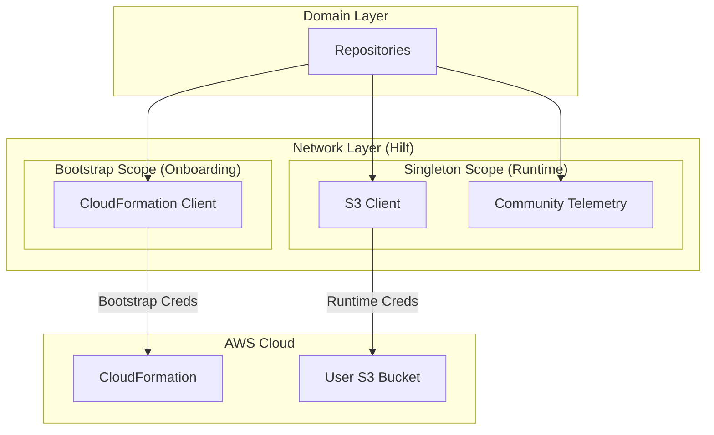
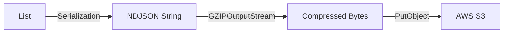
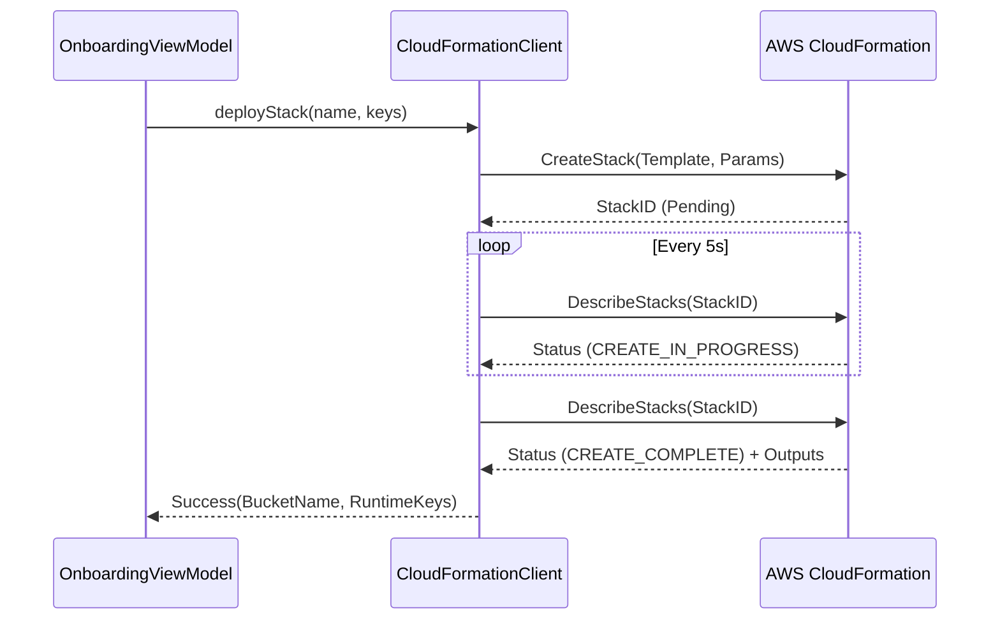

# Network & Infrastructure Specification

**Related Requirements:** [Process Definition](../process_implementation_definition.md), [Infrastructure](../infrastructure.md), [Domain Layer Spec](domain_layer_spec.md)

This document defines the implementation of the network layer, detailing how the application interacts with AWS (CloudFormation, S3) and the optional Community Telemetry service. It mandates the use of the **AWS SDK for Kotlin** to leverage Coroutines and a "Pure Kotlin" architecture.

## 1. Architecture Overview

The Network Layer is responsible for all external communication. It sits behind the **Domain Layer** repositories, hiding the complexity of AWS SDKs, HTTP clients, and serialization.

### 1.1. Technology Stack
*   **AWS SDK:** `aws.sdk.kotlin:s3`, `aws.sdk.kotlin:cloudformation`, `aws.sdk.kotlin:sts` (Official Kotlin SDK).
*   **HTTP Client:** `OkHttp` (underlying engine for AWS SDK and Retrofit).
*   **DI:** **Hilt** (Dagger) for providing clients and handling scope.
*   **Serialization:** `kotlinx.serialization` (JSON) + `java.util.zip.GZIPOutputStream`.
*   **Concurrency:** Kotlin Coroutines & Flow.

### 1.2. Client Separation
To adhere to the "Bootstrap vs. Runtime" security model, the network layer is split into two distinct modules:

1.  **Bootstrap Module:** Handles high-privilege, ephemeral operations (Stack Deployment). Dependencies are only injected into the `OnboardingViewModel`.
2.  **Runtime Module:** Handles daily low-privilege operations (Data Upload, History Sync). Dependencies are available to the `Worker` scope and main app.

### 1.3. Architecture Diagram


## 2. AWS Client Configuration

All AWS clients must be configured with consistent timeouts, retry policies, and identification.

### 2.1. Common Configuration
*   **Region:**
    *   **Bootstrap:** Defaults to `us-east-1` (Virginia) to simplify initial stack creation.
    *   **Runtime:** Must match the region of the created S3 bucket (derived from stack outputs or config).
*   **Timeouts:**
    *   Connect: **15 seconds**
    *   Read/Write: **60 seconds** (Accommodate slow mobile networks).
*   **User Agent:** Must include app name and version (e.g., `Locus-Android/1.0.0`).
*   **Retry Policy:**
    *   **Strategy:** Exponential Backoff.
    *   **Max Retries:** 3.
    *   **Base Delay:** 1 second.
    *   **Factor:** 2.0.
    *   **Scope:** Transient errors (IOException, 5xx). 4xx errors are fatal.

### 2.2. Credentials Providers
*   **Bootstrap:** `StaticCredentialsProvider` using the Access Key ID and Secret Key entered by the user.
*   **Runtime:** `StaticCredentialsProvider` using the keys stored in `EncryptedSharedPreferences`.

## 3. Data Transformation & Serialization

### 3.1. NDJSON Format
Data is serialized into **Newline Delimited JSON** to support streaming and easy concatenation.

*   **Library:** `kotlinx.serialization`.
*   **Schema:** Defined in Domain Models (`LocationPoint`, `LogEntry`), mapped to DTOs if wire format differs (e.g., shortening keys).

### 3.2. Compression
All uploaded files must be Gzipped.

*   **Implementation:** `GZIPOutputStream` wrapping a `ByteArrayOutputStream` (for small batches) or a file stream.
*   **Flow:**
    1.  Serialize List<T> to JSON String (line by line).
    2.  Write line + `\n` to GZIP stream.
    3.  Close stream.
    4.  Upload resulting bytes.

#### Data Pipeline Diagram


### 3.3. File Naming Convention
*   **Tracks:** `tracks/YYYY/MM/DD/<device_id>_<start_timestamp>_v1.json.gz`
    *   `v1` is the integer schema version.
*   **Logs:** `diagnostics/YYYY/MM/DD/<device_id>_<start_timestamp>_v1.json.gz`

## 4. API Interactions

### 4.1. Bootstrap Client (CloudFormation)
**Interface:** `InfrastructureProvisioner`

*   **Deploy Stack:**
    *   **Call:** `CreateStack`.
    *   **Logic:**
        *   Attempt to create the stack.
        *   If `AlreadyExistsException` is thrown (Recovery/Reinstall), strictly catch it and proceed to **Polling** (to ensure the existing stack is complete).
    *   **Parameters:**
        *   `StackName`: User-provided device name.
        *   `TemplateBody`: The YAML content of `locus-stack.yaml` (bundled in assets).
        *   `Parameters`: `StackName` (same as above).
        *   `Capabilities`: `CAPABILITY_NAMED_IAM`.
    *   **Polling:** Use `DescribeStacks` every 5 seconds to check `StackStatus`.
    *   **Success:** Status is `CREATE_COMPLETE`.
    *   **Output Retrieval:** Parse `Outputs` to get `BucketName`, `AccessKeyId`, `SecretAccessKey`.

#### Bootstrap Sequence


### 4.2. Runtime Client (S3)
**Interface:** `RemoteStorageInterface`

*   **Upload Data:**
    *   **Call:** `PutObject`.
    *   **Bucket:** From Config.
    *   **Key:** Generated Path.
    *   **Body:** ByteStream (Gzipped content).
    *   **Metadata:**
        *   `x-amz-object-lock-retain-until-date`: **Current Date + 100 Years** (Tracks Only).
    *   **Error Handling:**
        *   `S3Exception` (403/401) -> `AuthException` (Trigger user alert).
        *   `S3Exception` (5xx) / `IOException` -> `NetworkException` (Retry later).

*   **List History:**
    *   **Call:** `ListObjectsV2`.
    *   **Prefix:** `tracks/YYYY/MM/` (Lazy load by month).
    *   **Mapping:** Convert `S3Object` summaries to `TrackFileMetadata` domain objects.

*   **Download Track:**
    *   **Call:** `GetObject`.
    *   **Processing:** Stream `body` -> `GZIPInputStream` -> `BufferedReader` -> `Json.decodeFromString`.

## 5. Community Telemetry (Optional)

This module handles the optional upload of anonymous crash reports.

### 5.1. Interface
```kotlin
interface CommunityTelemetryRemote {
    suspend fun uploadCrashReport(report: CrashReportDto): Result<Unit>
    suspend fun uploadAnonymizedStats(stats: CommunityStatsDto): Result<Unit>
}
```

### 5.2. Implementation Variants (Flavors)

*   **`standard` Flavor:**
    *   **Library:** Retrofit + OkHttp.
    *   **Base URL:** `BuildConfig.COMMUNITY_API_URL`.
    *   **Auth:** None (Public endpoint) or API Key if required in future.
    *   **Logic:** Simple POST request.

*   **`foss` Flavor:**
    *   **Implementation:** No-Op (Stub).
    *   **Logic:** Immediately returns `Result.Success` (or `Result.Failure` with "Disabled" message, handled gracefully by domain).

## 6. Hilt Modules

### 6.1. `NetworkModule` (InstallIn: SingletonComponent)
*   Provides: `Json` (kotlinx configuration), `OkHttpClient` (shared configuration).

### 6.2. `BootstrapModule` (InstallIn: ViewModelComponent)
*   Provides: `CloudFormationClient` (Scoped to Onboarding).

### 6.3. `RuntimeModule` (InstallIn: SingletonComponent)
*   Provides: `S3Client`, `CommunityTelemetryRemote`.
*   **Note:** `S3Client` provider must lazily check for credentials. If credentials are missing (not yet set up), it should defer creation or throw a specific initialization error caught by the repository.

## 7. Security Considerations

*   **TLS:** All connections use HTTPS (enforced by AWS SDK and Android default network security config).
*   **Memory:** Bootstrap credentials must be passed to the client builder and then explicitly cleared/nullified in the UI layer once the process is complete.
*   **Logging:** **NEVER** log headers or bodies containing Access Keys or Session Tokens. Configure AWS SDK logging to `Level.None` or `Level.Basic` (sanitized).
