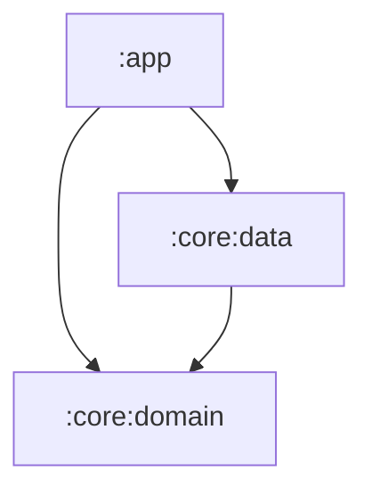

# Project Structure & Architecture

**Related Requirements:** [Android Architecture](../android_architecture.md), [Domain Layer Spec](domain_layer_spec.md)

This document defines the high-level module structure and the internal package organization for the Locus Android application.

## 1. Modular Architecture

The project follows a **Multi-Module** architecture to strictly enforce the "Pure Kotlin Domain" rule and improve build times.

### 1.1. Module Graph

### 1.2. Module Definitions

*   **`:core:domain`**
    *   **Type:** Pure Kotlin/Java Library.
    *   **Dependencies:** None (Standard Library only). **NO Android Dependencies.**
    *   **Contents:** Domain Models, Repository Interfaces, Use Cases, sealed `Result` classes.
    *   **Purpose:** The business logic core.

*   **`:core:data`**
    *   **Type:** Android Library.
    *   **Dependencies:** `:core:domain`, Room, Retrofit, AWS SDK.
    *   **Contents:** Repository Implementations, Room Entities/DAOs, Network Clients, Shared Preferences.
    *   **Purpose:** Data retrieval and persistence.

*   **`:app`**
    *   **Type:** Android Application.
    *   **Dependencies:** `:core:domain`, `:core:data`, Hilt, Compose.
    *   **Contents:** UI (Activities, Screens), ViewModels, DI Modules (Hilt), Services, Workers.
    *   **Purpose:** The user-facing application and entry point.

## 2. Package Structure (`:app`)

The application module uses a **Feature-First** structure to maximize cohesion.

### 2.1. Top-Level Packages (`com.locus.android`)

*   **`features`**: Contains feature-specific code.
*   **`di`**: Hilt modules that glue everything together (e.g., `AppModule`).
*   **`service`**: Foreground Services (e.g., `TrackerService`).
*   **`workers`**: WorkManager classes (e.g., `SyncWorker`).
*   **`ui`**: Shared UI components (Theme, Common Composables).

### 2.2. Feature Packages (`features.*`)

Each feature package is self-contained:

*   **`com.locus.android.features.dashboard`**
    *   `DashboardScreen.kt` (Compose UI)
    *   `DashboardViewModel.kt`
    *   `components/` (StatusCard, StatsGrid)
*   **`com.locus.android.features.map`**
    *   `MapScreen.kt`
    *   `MapViewModel.kt`
*   **`com.locus.android.features.settings`**
*   **`com.locus.android.features.onboarding`**

## 3. Package Structure (`:core:domain`)

*   **`com.locus.core.domain`**
    *   `model` (Data Classes: `LocationPoint`, `LogEntry`)
    *   `repository` (Interfaces: `LocationRepository`)
    *   `usecase` (Classes: `PerformSyncUseCase`)
    *   `result` (Sealed Class: `Result`)

## 4. Package Structure (`:core:data`)

*   **`com.locus.core.data`**
    *   `repository` (Implementations: `LocationRepositoryImpl`)
    *   `local` (Room: `LocusDatabase`, `LocationDao`, `LocationEntity`)
    *   `remote` (Network: `S3Client`, `CloudFormationClient`)
    *   `mapper` (Entity <-> Model Mappers)
