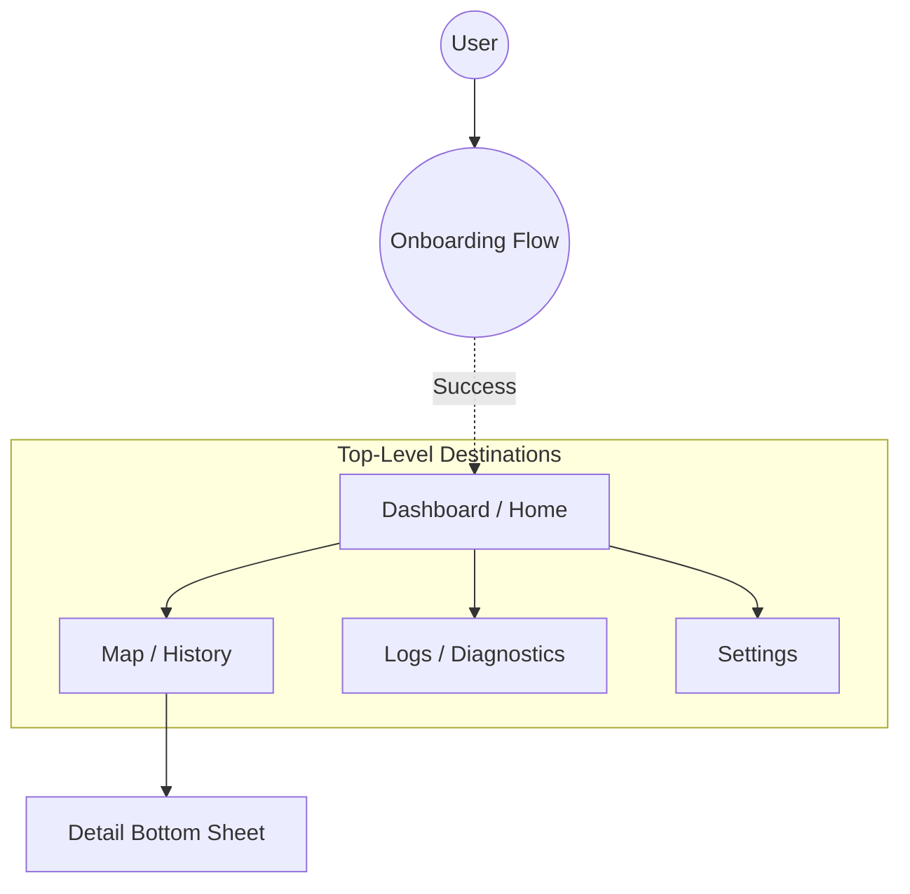

# Navigation Architecture

**Parent:** [UI & Presentation Specification](../ui_presentation_spec.md)

The application uses an adaptive hierarchy that switches between a **Bottom Navigation Bar** (Phone) and a **Navigation Rail** (Tablet) for top-level destinations.

## 1. Layout Strategy

### 1.1. Standard Layout (Phone)
*   **Component:** Persistent **Bottom Navigation Bar**.
*   **Behavior:** The bar is strictly persistent and **never hides on scroll**. It anchors to the bottom of the screen.

### 1.2. Large Screen Layout (Tablet/Landscape > 600dp)
*   **Component:** Persistent **Navigation Rail**.
*   **Behavior:** Anchored to the **left edge** of the screen. It remains visible at all times and does not hide.
*   **Structure:**
    *   Top Alignment: Navigation destinations.
    *   Vertical Arrangement: Icons stacked vertically.

## 2. Navigation Graph (Mermaid)

## 3. Top-Level Destinations
Standardized using **Material Symbols**:

1.  **Dashboard** (`dashboard`): Current status, immediate stats, manual actions.
2.  **Map** (`map`): Historical data visualization and exploration.
3.  **Logs** (`terminal`): Real-time diagnostic log stream and filters.
4.  **Settings** (`settings`): Configuration, identity, and app-wide preferences.

## 4. Navigation & Back Handling

### 4.1. General
*   **Dashboard:** As the start destination, pressing the Back Button must background the application (standard Android Home behavior).

### 4.2. Map Back-Stack Logic
A strict hierarchy defines the Back Button behavior on the Map screen:

1.  **Point Detail Mode:** If viewing point details, **Close** to return to Day Summary (Mode A).
2.  **Expanded Bottom Sheet:** If the sheet is expanded, **Collapse** to minimized state.
3.  **Minimized Sheet:** If the sheet is minimized (and in Day Summary mode), **Background** the application.
