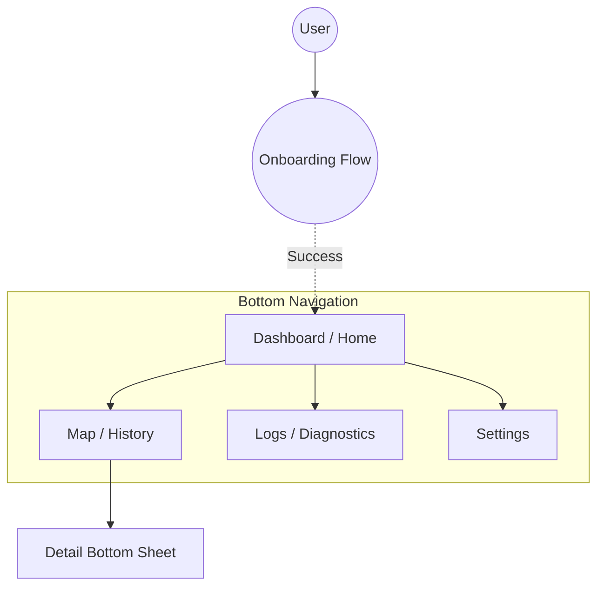

# UI & Presentation Specification

**Related Requirements:** [UI Feedback](../requirements/ui_feedback.md), [Visualization](../requirements/visualization.md), [Setup & Onboarding](../requirements/setup_onboarding.md)

This document defines the user interface architecture, navigation flows, and visual presentation layer for the Locus Android application.

## 1. Design System & Philosophy

### 1.1. Visual Style
*   **Framework:** **Material Design 3 (Material You)**. The app must leverage dynamic coloring based on the user's system wallpaper to feel native and integrated.
*   **Theme:** Fully supported **Light** and **Dark** modes, respecting the system-wide setting by default.
*   **Typography:** Use the standard Material Type Scale (Headline, Title, Body, Label) with support for Dynamic Type (system font scaling).
*   **Iconography:** Filled icons for active states, outlined icons for inactive states (Material Symbols).

### 1.2. Philosophy: "Subtle by Default"
*   **Notification:** The Persistent Notification is the primary status indicator outside the app. It must never beep or vibrate unless a **Fatal Error** occurs.
*   **In-App:** Transient errors (e.g., "Network Timeout") are displayed as unobtrusive Snackbars or inline status text, never modal dialogs.
*   **Transparency:** The UI must always answer "What is the app doing right now?" (e.g., Recording, Syncing, Idle).

## 2. Navigation Architecture

The application uses a flat hierarchy with a **Bottom Navigation Bar** for top-level destinations.

### 2.1. Navigation Graph (Mermaid)



### 2.2. Top-Level Destinations
1.  **Dashboard:** Current status, immediate stats, manual actions.
2.  **Map:** Historical data visualization and exploration.
3.  **Logs:** Real-time diagnostic log stream and filters.
4.  **Settings:** Configuration, identity, and app-wide preferences.

## 3. Screen Specifications

### 3.1. Dashboard (Home)
**Purpose:** Provide an "at-a-glance" view of system health and allow manual overrides.

**Layout Behavior:**
*   **Scrollable Column:** The content fits in a single vertical scroll container.
*   **Status Card:** Pinned to the top or the first item in the scroll list.
*   **Responsiveness:** On larger screens (Landscape/Tablet), the "Status Card" and "Stats Grid" display side-by-side.

**Components:**
*   **Status Card:** A prominent card mirroring the Persistent Notification state.
*   **Stats Grid:** "Local Buffer" count, "Last Sync" time, "Next Sync" estimate.
*   **Actions:** "Sync Now" button (Manual Sync).
*   **Sensor Status:** Small indicators for GPS, Network, and Battery state.

**ASCII Wireframe:**
```text
+--------------------------------------------------+
|  [ STATUS CARD ]                                 |
|  Status: Recording (High Accuracy)               |
|  State:  Synced                                  |
|  ----------------------------------------------  |
|  [ GPS: 12 Sats ]  [ Bat: 85% ]  [ Net: WiFi ]   |
+--------------------------------------------------+
|                                                  |
|   +----------------+      +----------------+     |
|   |  1,240         |      |  5 mins ago    |     |
|   |  Buffered Pts  |      |  Next: ~10m    |     |
|   +----------------+      +----------------+     |
|                                                  |
+--------------------------------------------------+
|                                                  |
|           [  SYNC NOW (Cloud Icon)  ]            |  <-- Primary Action (Filled Tonal)
|                                                  |
+--------------------------------------------------+
| [Dashboard]    Map       Logs      Settings      |  <-- Bottom Nav
+--------------------------------------------------+
```

### 3.2. Map (Visualization)
**Purpose:** Verify and explore historical movement data.

**Layout Behavior:**
*   **Full Screen:** The map view occupies the entire screen behind transparent system bars.
*   **Overlays:** Controls and Action Buttons are anchored to the edges (safe area insets).
*   **Bottom Sheet:** A persistent sheet that peaks at the bottom (minimized height) and expands on drag or tap. It does *not* cover the whole map when minimized, only showing essential text.

**Components:**
*   **Map View:** Full-screen `osmdroid` view.
*   **Controls:** Standard pinch-to-zoom gestures AND on-screen Zoom Buttons (+/-) for accessibility.
*   **Actions:** "Share/Snapshot" button to export the current view as an image.
*   **Layer Switcher (Overlay):** Toggle "Signal Heatmap", "Satellite", etc.
*   **Summary Card (Bottom Sheet):** Persistent summary of the selected day.
    *   *Height:* Minimized by default to show only essential stats, maximizing map area.
    *   *Date Interaction:* The Date text is a clickable touch target (min 48x48dp) that opens the **Standard Modal Date Picker**.
    *   *Accessibility:* Must have a clear Content Description (e.g., "Change Date, current is Oct 4").

**ASCII Wireframe:**
```text
+--------------------------------------------------+
|                                [Share]  [Layers] |  <-- Action Overlays
|               ( Map Area )                       |
|         . . . . . . . . . . .                    |
|         .                   .                    |
|         .    (Track Line)   .                    |
|         .                   .                    |
|         . . . . . . . . . . .                    |
|                                                  |
+--------------------------------------------------+
|  [ October 4, 2023 (v) ]                         |  <-- Clickable Date (Opens Modal)
|  12.4 km  •  4h 20m  •  24 km/h avg              |
+--------------------------------------------------+
| [Dashboard]   [Map]      Logs      Settings      |
+--------------------------------------------------+
```

### 3.3. Logs (Diagnostics)
**Purpose:** Provide deep technical insight into the system's operation. While essential for verification during the "Implementation Definition" phase, this screen also serves as a critical diagnostic tool for users to verify system health in production.

**Layout Behavior:**
*   **Sticky Header:** The Filter Chips row remains pinned to the top while the list scrolls.
*   **Reverse Layout:** The list starts from the bottom (newest items) by default, or auto-scrolls to bottom on new entries unless the user has scrolled up.

**Components:**
*   **Filter Chips:** Multi-select Checkboxes (not Radio buttons) to filter by tag/level.
    *   *Design:* Must be distinctively color-coded (e.g., Error=Red, Warn=Yellow, Net=Blue) to match the corresponding log lines.
    *   *Accessibility:* Colors must meet contrast requirements.
*   **Log List:** Scrollable list of log entries. Lines are color-coded to match their severity/category.
*   **Export/Copy:** Action to copy logs or save to file.

**ASCII Wireframe:**
```text
+--------------------------------------------------+
|                                          [Share] |
+--------------------------------------------------+
|  [x] Error   [ ] Warn   [ ] Net   [ ] Auth       |  <-- Multi-select Chips (Colored)
+--------------------------------------------------+
| 14:02:10 [Loc] RecordPoint: Acc=12m              |
| 14:02:05 [Net] Upload: Success (200 OK)          |
| 14:01:55 [S3]  ListObjects: tracks/2023/10       |
| 14:01:40 [Wtch] Heartbeat: OK                    |
| 14:00:00 [Bat] Level: 84% (Discharging)          |
| ...                                              |
+--------------------------------------------------+
| [Dashboard]    Map      [Logs]     Settings      |
+--------------------------------------------------+
```

### 3.4. Onboarding (Setup)
*   **Reference:** See [Onboarding UI Specification](ui_onboarding_spec.md) for detailed flows, wireframes (Welcome, Credentials, New Device vs. Recovery), and interaction rules.

### 3.5. Settings
**Purpose:** Manage configuration, identity, and application behavior.

**Layout Behavior:**
*   **Grouped List:** Settings are organized into distinct categories (Identity, General, Data) with headers.
*   **Standard List Items:** Uses standard Material Design list items with switches or chevrons.

**Components:**
*   **Identity:** Display current "Device ID" and "AWS Stack Name".
*   **Preferences:** Toggles for "Unit System" (Metric/Imperial), "Theme" (System/Light/Dark).
*   **Danger Zone:**
    *   "Unlink Device"
    *   "Clear Local Buffer" (Red Text). *Warning:* Tapping this immediately deletes all unsynced data from the device. This action is irreversible and causes **Data Loss**.
*   **About:** Version info and link to source code.

**ASCII Wireframe:**
```text
+--------------------------------------------------+
|  Settings                                        |
+--------------------------------------------------+
|  Identity                                        |
|  Device: Pixel7 (Locus-Pixel7)                   |
|  ----------------------------------------------  |
|  General                                         |
|  [x] Dark Mode                                   |
|  [ ] Metric Units (km)                           |
|  ----------------------------------------------  |
|  Data (Danger Zone)                              |
|  [ Force Upload (Manual Sync) ]                  |
|  [ Clear Local Cache (!) ]                       | <--- Triggers Confirmation Dialog
|  ----------------------------------------------  |
|  Version 1.0.0 (12)                              |
+--------------------------------------------------+
```

## 4. Feedback Mechanisms

### 4.1. Persistent Notification
**Purpose:** Keep the service alive and provide status without opening the app.
**Format:** `[Recording Status] • [Sync Status]`

**ASCII Wireframe:**
```text
+--------------------------------------------------+
|  (Locus Icon)  Locus • Recording                 |
|  Tracking (High Accuracy) • Synced               |
|  [ STOP TRACKING ]                               |  <-- Action Button
+--------------------------------------------------+
```

### 4.2. In-App Feedback
*   **Toast:** Used only for simple confirmations (e.g., "Sync Complete").
*   **Snackbar:** Used for transient warnings or actionable info (e.g., "Network Timeout - Retrying... [Retry Now]").
*   **Dialogs:** Reserved strictly for **Tier 3 Fatal Errors** or destructive confirmations (e.g., "Delete History").

### 4.3. Map Overlays
*   **Visual Discontinuity:** Track lines must break if the time gap > 5 minutes.
*   **Signal Quality:** When the "Heatmap" layer is active, the map displays a **True Heat Map Overlay** (gradient cloud).
    *   **No Data:** Areas with *no* signal data must display a **Neutral Low-Gradient Cloud** (e.g., Gray mist) to visually distinguish "Unknown" from "Weak Signal" (Red) or "Strong Signal" (Green).

## 5. Accessibility (A11y) Requirements
*   **Touch Targets:** All interactive elements (FABs, Calendar dates) must be at least **48x48dp**.
*   **Content Descriptions:** Mandatory for all icons (e.g., "Signal Strength: Good", "Battery: Charging").
*   **Color Blindness:** The Signal Heatmap must use colors distinguishing enough for common vision deficiencies, or offer a pattern alternative (e.g., dashed lines).
*   **Scale:** Layouts must adapt to System Font Scale up to 200%.
