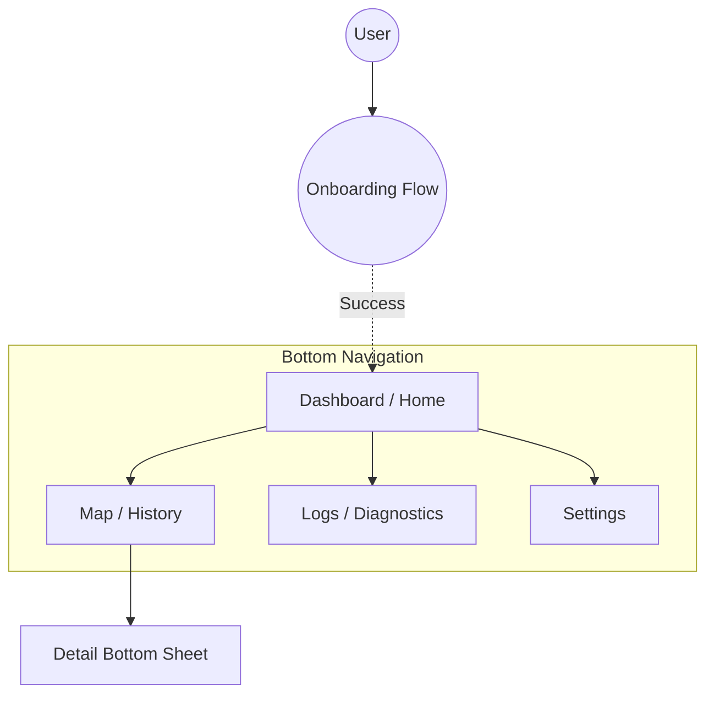

# UI & Presentation Specification

**Related Requirements:** [UI Feedback](../requirements/ui_feedback.md), [Visualization](../requirements/visualization.md), [Setup & Onboarding](../requirements/setup_onboarding.md)

This document defines the user interface architecture, navigation flows, and visual presentation layer for the Locus Android application.

## 1. Design System & Philosophy

### 1.1. Visual Style
*   **Framework:** **Material Design 3 (Material You)**. The app must leverage dynamic coloring based on the user's system wallpaper to feel native and integrated.
*   **Theme:** Fully supported **Light** and **Dark** modes, respecting the system-wide setting by default.
*   **Typography:** Use the standard Material Type Scale (Headline, Title, Body, Label) with support for Dynamic Type (system font scaling).
*   **Iconography:** Filled icons for active states, outlined icons for inactive states (Material Symbols).

### 1.2. Philosophy: "Subtle by Default"
*   **Notification:** The Persistent Notification is the primary status indicator outside the app. It must never beep or vibrate unless a **Fatal Error** occurs.
*   **In-App:** Transient errors (e.g., "Network Timeout") are displayed as unobtrusive Snackbars or inline status text, never modal dialogs.
*   **Transparency:** The UI must always answer "What is the app doing right now?" (e.g., Recording, Syncing, Idle).

## 2. Navigation Architecture

The application uses a flat hierarchy with a **Bottom Navigation Bar** for top-level destinations.

### 2.1. Navigation Graph (Mermaid)



### 2.2. Top-Level Destinations
1.  **Dashboard:** Current status, immediate stats, manual actions.
2.  **Map:** Historical data visualization and exploration.
3.  **Logs:** Real-time diagnostic log stream and filters.
4.  **Settings:** Configuration, identity, and app-wide preferences.

### 2.3. Navigation & Back Handling
*   **Map:** Pressing the Back Button while the "Bottom Sheet" is expanded/open must collapse/close the sheet first. If the sheet is already minimized, the Back Button acts normally (backgrounds app).
*   **Dashboard:** As the start destination, pressing the Back Button must background the application (standard Android Home behavior).

## 3. Screen Specifications

### 3.1. Dashboard (Home)
**Purpose:** Provide an "at-a-glance" view of system health and allow manual overrides.

**Layout Behavior:**
*   **Phone (Portrait):** Scrollable Column. Status Card pinned to top.
*   **Phone (Landscape):** Scrollable Column (Standard).
*   **Tablet/Large Screen (Landscape > 600dp):** Two-pane layout. Status Card (Left Pane) fixed, Stats & History (Right Pane) scrollable.

**Components:**
*   **Status Card:** A prominent card mirroring the Persistent Notification state. Handles "Active", "Error", and "User Stopped" states.
*   **Stats Grid:** "Local Buffer" count, "Last Sync" time, "Next Sync" estimate.
*   **Actions:** "Sync Now" button.
    *   *Behavior:* When tapped, transforms into a **Linear Progress Indicator** showing "Uploading batch X of Y..." until completion.
    *   *Error Handling:* Transient failures (e.g., "Network Error") must appear as a **Snackbar** anchored above the bottom navigation.
*   **Sensor Status:** Small indicators for GPS, Network, and Battery state.
    *   *Design:* These must use dynamic **color and icon changes** (e.g., Green Check, Red Alert, Grey Slash) to indicate state, rather than just static text, to ensure quick readability.

**ASCII Wireframe (Active - Phone Portrait):**
```text
+--------------------------------------------------+
|  [ STATUS CARD ]                                 |
|  Status: Recording (High Accuracy)               |
|  State:  Synced                                  |
|  ----------------------------------------------  |
|  [ (Sat) GPS: Good ] [ (Bat) 85% ] [ (Wifi) ]    | <-- Icons colored by state (Grn/Yel/Red)
+--------------------------------------------------+
|                                                  |
|   +----------------+      +----------------+     |
|   |  1,240         |      |  5 mins ago    |     |
|   |  Buffered Pts  |      |  Next: ~10m    |     |
|   +----------------+      +----------------+     |
|                                                  |
+--------------------------------------------------+
|                                                  |
|           [  SYNC NOW (Cloud Icon)  ]            |  <-- Primary Action (Filled Tonal)
|      (Becomes: [=== 50% ===] Batch 1/2)          |
|                                                  |
+--------------------------------------------------+
| [Dashboard]    Map       Logs      Settings      |  <-- Bottom Nav
+--------------------------------------------------+
```

**ASCII Wireframe (Active - Tablet Landscape):**
```text
+------------------------------------+------------------------------------+
|  [ STATUS CARD ]                   |  Buffered: 1,240                   |
|  Status: Recording                 |  Last Sync: 5 mins ago             |
|  State:  Synced                    |                                    |
|  --------------------------------  |  [ SYNC NOW (Cloud Icon) ]         |
|  [GPS] [Bat] [Wifi]                |                                    |
|                                    |  Recent Activity                   |
|  (This pane fixed height/width)    |  - Yesterday: 14km                 |
|                                    |  - Oct 4: 12km                     |
|                                    |                                    |
+------------------------------------+------------------------------------+
| [Dashboard]    Map        Logs       Settings                           |
+-------------------------------------------------------------------------+
```

**Status Card (User Stopped):**
```text
+--------------------------------------------------+
|  [ STATUS CARD ] (Yellow/Grey Background)        |
|  Status: Stopped by User                         |
|  State:  Idle                                    |
|  ----------------------------------------------  |
|  Tracking paused. Tap to resume.                 |
|                                                  |
|           [ RESUME TRACKING ]                    |
+--------------------------------------------------+
```

**Status Card (Error State - Tier 3 Fatal):**
```text
+--------------------------------------------------+
|  [ STATUS CARD ] (Red Background)                |
|  Status: Service Halted                          |
|  Error:  Permission Revoked                      |
|  ----------------------------------------------  |
|  Locus requires "Always Allow" location access   |
|  to function.                                    |
|                                                  |
|  [ FIX ISSUE (Opens Settings) ]                  |
+--------------------------------------------------+
```

### 3.2. Map (Visualization)
**Purpose:** Verify and explore historical movement data.

**Layout Behavior:**
*   **Full Screen:** The map view occupies the entire screen behind transparent system bars.
*   **Overlays:** Controls and Action Buttons are anchored to the edges (safe area insets).
*   **Bottom Sheet:** A persistent sheet that peaks at the bottom (minimized height) and expands on drag or tap. It does *not* cover the whole map when minimized, only showing essential text.
    *   *Tablet Constraint:* On large screens, the Bottom Sheet must have a maximum width (e.g., `600dp`) and be centered horizontally to avoid excessive stretching.

**Components:**
*   **Map View:** Full-screen `osmdroid` view.
    *   *Theme:* **Dark Mode Support:** The map tiles themselves must visually adapt to Dark Mode (e.g., using a dark style or inverted colors) when the system theme is Dark.
    *   *Performance:* **Downsampling:** The rendered path is visually simplified (e.g., Ramer-Douglas-Peucker) for performance; zooming in reveals more detail.
*   **Controls:** Standard pinch-to-zoom gestures AND on-screen Zoom Buttons (+/-) for accessibility.
*   **Actions:** "Share/Snapshot" button to export the current view as an image.
*   **Layer Switcher (Bottom Sheet):**
    *   *Trigger:* FAB or Overlay Button.
    *   *Content:* Radio selection for Map Type (Standard, Satellite), Toggles for Overlays (Heatmap).
*   **Empty State (No History):**
    *   If no data is recorded/selected, Map centers on user location. Bottom Sheet displays "No data recorded today."
*   **Empty State (Network Error):**
    *   If S3 Index cannot be fetched: Map centers on user. Bottom Sheet displays "Offline: Cannot fetch history." with a "Retry" text button.
*   **Bottom Sheet (Multi-Mode):**
    *   **Mode A (Day Summary):** Persistent summary of the selected day.
    *   **Mode B (Point Detail):** Displays details when a track point is tapped.
    *   **Dismissal:** Users can return to Mode A by tapping the map area, swiping the sheet down, or tapping the Close button.
    *   **Date Interaction:** The Date text is a clickable touch target that opens a **Custom Calendar Picker** (Modal Bottom Sheet).
        *   *Feature:* The Calendar must display **Data Indicators** (dots) on days that have verified historical data.
        *   *Loading:* Displays an indeterminate progress bar while fetching S3 index.
    *   **Accessibility:** Must have a clear Content Description (e.g., "Change Date, current is Oct 4").

**ASCII Wireframe (Calendar Picker):**
```text
+--------------------------------------------------+
|  Select Date                                     |
|  ( Indeterminate Progress Bar if Loading... )    |
|                                                  |
|  <  October 2023  >                              |
|  Su Mo Tu We Th Fr Sa                            |
|      1  2  3  4  5  6                            |
|                  .                               |
|   7  8  9 10 11 12 13                            |
|      .     .                                     |
|  ....................                            |
+--------------------------------------------------+
```

**ASCII Wireframe (Day Summary):**
```text
+--------------------------------------------------+
|                                [Share]  [Layers] |  <-- Action Overlays
|               ( Map Area )                       |
|         . . . . . . . . . . .                    |
|         .                   .                    |
|         .    (Track Line)   .                    |
|         .                   .                    |
|         . . . . . . . . . . .                    |
|                                                  |
+--------------------------------------------------+
|  [ October 4, 2023 (v) ]                         |  <-- Clickable (Opens Data-Dot Calendar)
|  12.4 km  •  4h 20m  •  24 km/h avg              |
+--------------------------------------------------+
| [Dashboard]   [Map]      Logs      Settings      |
+--------------------------------------------------+
```

**ASCII Wireframe (Point Detail):**
```text
+--------------------------------------------------+
|               ( Map Area )                       |
|             (Selected Point O)                   |
+--------------------------------------------------+
|  [ X ] Close Detail                              |
|  14:02:15  •  35 km/h  •  Bat: 84%               |
|  Signal: WiFi (Level 3, -65 dBm)                 |
+--------------------------------------------------+
```

**ASCII Wireframe (Network Error):**
```text
+--------------------------------------------------+
|                                                  |
|               ( Map Area )                       |
|                                                  |
+--------------------------------------------------+
|  Offline: Cannot fetch history index.            |
|               [ RETRY ]                          |
+--------------------------------------------------+
```

### 3.3. Logs (Diagnostics)
**Purpose:** Provide deep technical insight into the system's operation. While essential for verification during the "Implementation Definition" phase, this screen also serves as a critical diagnostic tool for users to verify system health in production.

**Layout Behavior:**
*   **Sticky Header:** The Filter Chips row remains pinned to the top while the list scrolls.
*   **Reverse Layout (StackFromBottom):** The `RecyclerView` starts from the bottom (newest items) by default. New entries are appended to the bottom. If the user is at the bottom, it auto-scrolls; if the user has scrolled up, it maintains position.

**Components:**
*   **Filter Chips:** Multi-select Checkboxes (not Radio buttons) to filter by tag/level.
    *   *Design:* Must be distinctively color-coded (e.g., Error=Red, Warn=Yellow, Net=Blue) to match the corresponding log lines.
    *   *Accessibility:* Colors must meet contrast requirements.
*   **Log List:** Scrollable list of log entries. Lines are color-coded to match their severity/category.
*   **Export/Copy:** Action to copy logs or save to file.
    *   *Behavior:* Tapping "Share" exports the **entire raw log buffer** (all lines, unfiltered) as a `.txt` file attachment to ensure full context for debugging.

**ASCII Wireframe:**
```text
+--------------------------------------------------+
|                                          [Share] |
+--------------------------------------------------+
|  [x] Error   [ ] Warn   [ ] Net   [ ] Auth       |  <-- Multi-select Chips (Colored)
+--------------------------------------------------+
| 14:02:10 [Loc] RecordPoint: Acc=12m              |
| 14:02:05 [Net] Upload: Success (200 OK)          |
| 14:01:55 [S3]  ListObjects: tracks/2023/10       |
| 14:01:40 [Wtch] Heartbeat: OK                    |
| 14:00:00 [Bat] Level: 84% (Discharging)          |
| ...                                              |
+--------------------------------------------------+
| [Dashboard]    Map      [Logs]     Settings      |
+--------------------------------------------------+
```

### 3.4. Onboarding (Setup)
*   **Reference:** See [Onboarding UI Specification](ui_onboarding_spec.md) for detailed flows, wireframes (Welcome, Credentials, New Device vs. Recovery), and interaction rules.

### 3.5. Settings
**Purpose:** Manage configuration, identity, and application behavior.

**Layout Behavior:**
*   **Grouped List:** Settings are organized into distinct categories (Identity, General, Data) with headers.
*   **Standard List Items:** Uses standard Material Design list items with switches or chevrons.

**Components:**
*   **Identity:** Display current "Device ID" and "AWS Stack Name".
*   **Preferences (General):**
    *   "Theme": Tapping opens a Dialog to select [System Default | Light | Dark].
    *   "Unit System": Toggle (Metric/Imperial).
    *   "Share Anonymous Stats": Toggle (Opt-in). Help improve Locus by sharing crash reports and basic health stats.
*   **Data:**
    *   "Flush Buffer to Cloud" (Manual Sync). Useful for verifying data safety before clearing cache.
*   **Danger Zone:**
    *   "Clear Local Buffer" (Red Text). *Warning:* Tapping this immediately deletes all unsynced data from the device. This action is irreversible and causes **Data Loss**.
    *   "Reset App" (Red Text). *Warning:* Wipes all keys, databases, and preferences. Returns app to "Fresh Install" state (Onboarding).
*   **About:** Version info and link to source code.

**ASCII Wireframe:**
```text
+--------------------------------------------------+
|  Identity                                        |
|  Device: Pixel7 (Locus-Pixel7)                   |
|  ----------------------------------------------  |
|  General                                         |
|  Theme: System Default                           |
|  [ ] Metric Units (km)                           |
|  [ ] Share Anonymous Stats                       |
|  ----------------------------------------------  |
|  Data                                            |
|  [ Flush Buffer to Cloud      ]                  |
|  ----------------------------------------------  |
|  Danger Zone                                     |
|  [ Clear Local Cache (!)      ]                  | <--- Triggers Confirmation Dialog
|  [ Reset Application (!)      ]                  | <--- Triggers Confirmation Dialog
|  ----------------------------------------------  |
|  Version 1.0.0 (12)                              |
+--------------------------------------------------+
```

## 4. Feedback Mechanisms

### 4.1. Persistent Notification
**Purpose:** Keep the service alive and provide status without opening the app.
**Format:** `[Recording Status] • [Sync Status]`

**ASCII Wireframe:**
```text
+--------------------------------------------------+
|  (Locus Icon)  Locus • Recording                 |
|  Tracking (High Accuracy) • Synced               |
|  [ STOP TRACKING ]                               |  <-- Action Button
+--------------------------------------------------+
```

### 4.2. In-App Feedback
*   **Toast:** Used only for simple confirmations (e.g., "Sync Complete").
*   **Snackbar:** Used for transient warnings or actionable info (e.g., "Network Timeout - Retrying... [Retry Now]").
*   **Blocking Full-Screen Error:** Reserved for **Tier 3 Fatal Errors** (e.g., Permission Revoked) where the app cannot function.
    *   *Behavior:* This screen appears **only** when the user opens the application (or brings it to the foreground). It does **not** overlay other apps or appear over the lock screen.
*   **Dialogs:** Reserved strictly for destructive confirmations (e.g., "Delete History").

**Blocking Error Screen (Wireframe):**
```text
+--------------------------------------------------+
|                                                  |
|              ( Alert Icon )                      |
|                                                  |
|            Action Required                       |
|                                                  |
|      Background Location Permission              |
|      has been revoked.                           |
|                                                  |
|      Locus cannot record tracks without it.      |
|                                                  |
+--------------------------------------------------+
|            [ OPEN SETTINGS ]                     |
+--------------------------------------------------+
```

**Stop Tracking Confirmation (Wireframe):**
```text
+--------------------------------------------------+
|  Stop Tracking?                                  |
|                                                  |
|  Location recording will cease.                  |
|  The app will enter a "User Stopped" state.      |
|                                                  |
|  (Note: You can resume anytime from the          |
|   Dashboard).                                    |
|                                                  |
|      [ CANCEL ]       [ STOP TRACKING ]          |
+--------------------------------------------------+
```

**Clear Buffer Confirmation (Wireframe):**
```text
+--------------------------------------------------+
|  Delete Unsynced Data?                           |
|                                                  |
|  You are about to delete 1,240 points from       |
|  the local device buffer.                        |
|                                                  |
|  This data has NOT been uploaded to S3 yet.      |
|  This action cannot be undone.                   |
|                                                  |
|      [ CANCEL ]       [ DELETE PERMANENTLY ]     |
+--------------------------------------------------+
```

### 4.3. Map Overlays
*   **Visual Discontinuity:** Track lines must break if the time gap > 5 minutes.
*   **Signal Quality:** When the "Heatmap" layer is active, the map displays a **True Heat Map Overlay** (gradient cloud) or a simplified line-style overlay.
    *   **Style:**
        *   **Cellular:** Solid Line (Colored by Strength).
        *   **WiFi:** Dashed/Dotted Line (Colored by Strength).
    *   **No Data:** Areas with *no* signal data must display a **Neutral Low-Gradient Cloud** (e.g., Gray mist) to visually distinguish "Unknown" from "Weak Signal" (Red) or "Strong Signal" (Green).

## 5. Accessibility (A11y) Requirements
*   **Touch Targets:** All interactive elements (FABs, Calendar dates) must be at least **48x48dp**.
*   **Content Descriptions:** Mandatory for all icons (e.g., "Signal Strength: Good", "Battery: Charging").
*   **Color Blindness:** The Signal Heatmap must use colors distinguishing enough for common vision deficiencies, or offer a pattern alternative (e.g., dashed lines).
*   **Scale:** Layouts must adapt to System Font Scale up to 200%.
