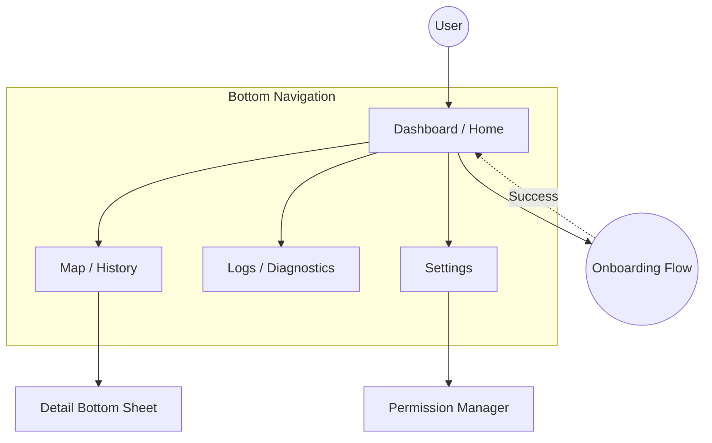

# UI & Presentation Specification

**Related Requirements:** [UI Feedback](../requirements/ui_feedback.md), [Visualization](../requirements/visualization.md), [Setup & Onboarding](../requirements/setup_onboarding.md)

This document defines the user interface architecture, navigation flows, and visual presentation layer for the Locus Android application.

## 1. Design System & Philosophy

### 1.1. Visual Style
*   **Framework:** **Material Design 3 (Material You)**. The app must leverage dynamic coloring based on the user's system wallpaper to feel native and integrated.
*   **Theme:** Fully supported **Light** and **Dark** modes, respecting the system-wide setting by default.
*   **Typography:** Use the standard Material Type Scale (Headline, Title, Body, Label) with support for Dynamic Type (system font scaling).
*   **Iconography:** Filled icons for active states, outlined icons for inactive states (Material Symbols).

### 1.2. Philosophy: "Subtle by Default"
*   **Notification:** The Persistent Notification is the primary status indicator outside the app. It must never beep or vibrate unless a **Fatal Error** occurs.
*   **In-App:** Transient errors (e.g., "Network Timeout") are displayed as unobtrusive Snackbars or inline status text, never modal dialogs.
*   **Transparency:** The UI must always answer "What is the app doing right now?" (e.g., Recording, Syncing, Idle).

## 2. Navigation Architecture

The application uses a flat hierarchy with a **Bottom Navigation Bar** for top-level destinations.

### 2.1. Navigation Graph (Mermaid)



### 2.2. Top-Level Destinations
1.  **Dashboard:** Current status, immediate stats, manual actions.
2.  **Map:** Historical data visualization and exploration.
3.  **Logs:** Real-time diagnostic log stream and filters.
4.  **Settings:** Configuration, identity, and app-wide preferences.

## 3. Screen Specifications

### 3.1. Dashboard (Home)
**Purpose:** Provide an "at-a-glance" view of system health and allow manual overrides.

**Components:**
*   **Status Card:** A prominent card mirroring the Persistent Notification state.
*   **Stats Grid:** "Local Buffer" count, "Last Sync" time.
*   **Actions:** "Sync Now" button (Manual Sync).
*   **Sensor Status:** Small indicators for GPS, Network, and Battery state.

**ASCII Wireframe:**
```text
+--------------------------------------------------+
|  Locus                                   (User)  |  <-- App Bar (Profile Icon)
+--------------------------------------------------+
|  [ STATUS CARD ]                                 |
|  Status: Recording (High Accuracy)               |
|  State:  Synced                                  |
|  ----------------------------------------------  |
|  [ GPS: 12 Sats ]  [ Bat: 85% ]  [ Net: WiFi ]   |
+--------------------------------------------------+
|                                                  |
|   +----------------+      +----------------+     |
|   |  1,240         |      |  5 mins ago    |     |
|   |  Buffered Pts  |      |  Last Sync     |     |
|   +----------------+      +----------------+     |
|                                                  |
+--------------------------------------------------+
|                                                  |
|           [  SYNC NOW (Cloud Icon)  ]            |  <-- Primary Action (Filled Tonal)
|                                                  |
+--------------------------------------------------+
| [Dashboard]    Map       Logs      Settings      |  <-- Bottom Nav
+--------------------------------------------------+
```

### 3.2. Map (Visualization)
**Purpose:** Verify and explore historical movement data.

**Components:**
*   **Map View:** Full-screen `osmdroid` view.
*   **Controls:** Standard pinch-to-zoom gestures AND on-screen Zoom Buttons (+/-) for accessibility.
*   **Calendar Strip:** A collapsible month/week view at the top to select dates. Highlight days with data.
*   **Layer Switcher (Overlay):** Toggle "Signal Heatmap", "Satellite", etc.
*   **Summary Card (Bottom Sheet):** Persistent summary of the selected day (Distance, Duration). Expands to show details.

**ASCII Wireframe:**
```text
+--------------------------------------------------+
|  <  October 2023  >                     [Today]  |  <-- Calendar Header
|  S  M  T  W  T  F  S                             |
|  1  2 [3][4] 5  6  7    ([ ] = Day with Data)    |
+--------------------------------------------------+
|                                         [Layers] |  <-- Layer Switcher Overlay
|               ( Map Area )                       |
|         . . . . . . . . . . .                    |
|         .                   .                    |
|         .    (Track Line)   .                    |
|         .                   .                    |
|         . . . . . . . . . . .                    |
|                                                  |
+--------------------------------------------------+
|  October 4, 2023                                 |  <-- Bottom Sheet (Collapsed)
|  12.4 km  •  4h 20m  •  24 km/h avg              |
+--------------------------------------------------+
| [Dashboard]   [Map]      Logs      Settings      |
+--------------------------------------------------+
```

### 3.3. Logs (Diagnostics)
**Purpose:** Deep technical insight into the system's operation (essential for "Implementation Definition" and debugging).

**Components:**
*   **Filter Chips:** "Error", "Warn", "Info", "Network", "GPS".
*   **Log List:** Scrollable list of log entries with timestamps and tags.
*   **Export/Copy:** Action to copy logs or save to file.

**ASCII Wireframe:**
```text
+--------------------------------------------------+
|  System Logs                             [Share] |
+--------------------------------------------------+
|  (X) Error   ( ) Warn   ( ) Net   ( ) Auth       |  <-- Horizontal Scroll Chips
+--------------------------------------------------+
| 14:02:10 [Loc] RecordPoint: Acc=12m              |
| 14:02:05 [Net] Upload: Success (200 OK)          |
| 14:01:55 [S3]  ListObjects: tracks/2023/10       |
| 14:01:40 [Wtch] Heartbeat: OK                    |
| 14:00:00 [Bat] Level: 84% (Discharging)          |
| ...                                              |
+--------------------------------------------------+
| [Dashboard]    Map      [Logs]     Settings      |
+--------------------------------------------------+
```

### 3.4. Onboarding (Setup)
**Purpose:** Guide the user from "Fresh Install" to "Tracking".

**Key Screens:**
1.  **Welcome:** "Bring Your Own Cloud" concept + "How to" link.
    *   *Note:* The documentation link must open in an **External Browser (Custom Tab)** to ensure user trust and allow access to password managers.
2.  **Credentials:** Input for AWS Keys (Access, Secret, Session).
3.  **Choice:** "New Device" vs. "Recovery".
4.  **Provisioning:** Progress indicator for CloudFormation.

**ASCII Wireframe (Credentials Step):**
```text
+--------------------------------------------------+
|  < Back                                          |
+--------------------------------------------------+
|  Connect AWS Account                             |
|                                                  |
|  See [Documentation] for how to generate keys.   |
|                                                  |
|  [ Access Key ID             ]                   |
|  [ Secret Access Key      (o)] (Show/Hide)       |
|  [ Session Token (Optional)  ]                   |
|                                                  |
|  [ Validate Credentials ]                        |
+--------------------------------------------------+
```

## 4. Feedback Mechanisms

### 4.1. Persistent Notification
*   **Format:** `[Recording Status] • [Sync Status]`
*   **Examples:**
    *   `Tracking (High Accuracy) • Synced`
    *   `Tracking (Offline) • Buffered: 140 pts`
    *   `Paused: Low Battery • Synced`

### 4.2. In-App Feedback
*   **Toast:** Used only for simple confirmations (e.g., "Sync Complete").
*   **Snackbar:** Used for transient warnings or actionable info (e.g., "Network Timeout - Retrying... [Retry Now]").
*   **Dialogs:** Reserved strictly for **Tier 3 Fatal Errors** or destructive confirmations (e.g., "Delete History").

### 4.3. Map Overlays
*   **Visual Discontinuity:** Track lines must break if the time gap > 5 minutes.
*   **Signal Quality:** When the "Heatmap" layer is active, the track line color shifts (e.g., Green=Strong, Red=Weak) and style changes (Solid=GPS, Dashed=WiFi) to indicate source/quality.

## 5. Accessibility (A11y) Requirements
*   **Touch Targets:** All interactive elements (FABs, Calendar dates) must be at least **48x48dp**.
*   **Content Descriptions:** Mandatory for all icons (e.g., "Signal Strength: Good", "Battery: Charging").
*   **Color Blindness:** The Signal Heatmap must use colors distinguishing enough for common vision deficiencies, or offer a pattern alternative (e.g., dashed lines).
*   **Scale:** Layouts must adapt to System Font Scale up to 200%.
