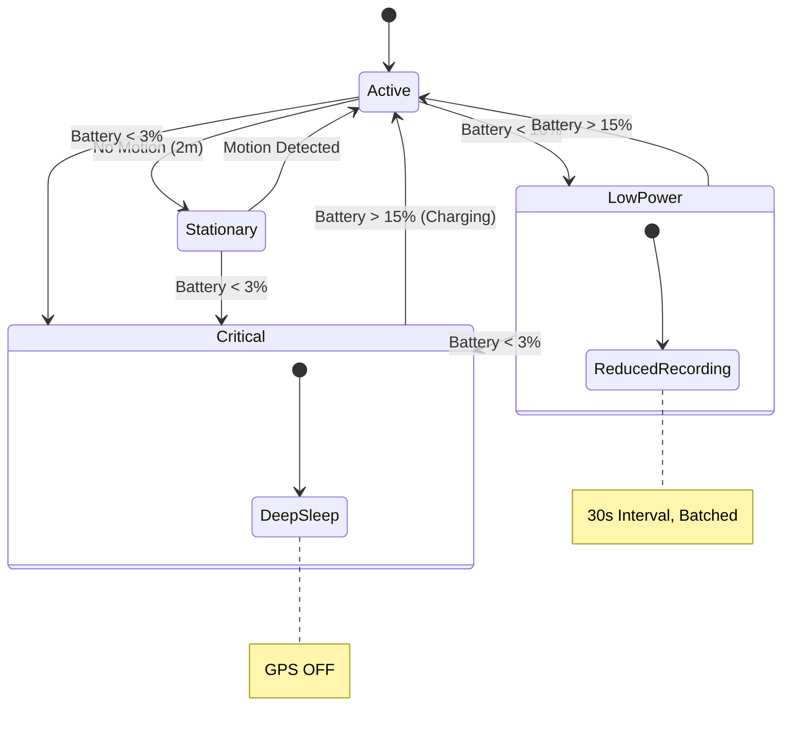

# Background Processing Specification

**Status:** Draft
**Related Requirements:** [Data Collection](../../requirements/data_collection.md), [Data Storage](../../requirements/data_storage.md), [Android Architecture](../android_architecture.md), [Telemetry](telemetry_spec.md), [Watchdog](runtime_watchdog_spec.md)

This document details the technical implementation of the Android Services, Workers, and State Machines that power the "Always On" nature of the application.

## 1. Foreground Service Strategy

The core data collection engine is the `TrackerService`.

*   **Type:** `ForegroundService` with `type="location"`.
*   **Sticky:** `START_STICKY` is used to allow the OS to automatically restart the service if killed due to memory pressure.
*   **Binding:** **None.** The service uses a "Fire and Forget" pattern. Communication to the UI is handled via the Domain Layer (Repositories/Flows), and commands from the UI are sent via standard `Intents` (`startService`, `stopService`).
*   **Wake Lock:**
    *   **Type:** `PARTIAL_WAKE_LOCK`.
    *   **Behavior:** Held **Transiently**. The Service does NOT hold a continuous lock. Instead, the `LocationManager` (via hardware batching) wakes the CPU periodically. The service acquires a lock only while processing the batch, then releases it to return to sleep.

### 1.1. Lifecycle Methods
*   `onStartCommand()`:
    1.  Check `StartTrackingUseCase` (Permissions/Battery).
    3.  If valid, transition to `Tracking` state.
    4.  Register `StationaryManager` and `BatteryState` observers.
    5.  Return `START_STICKY`.
*   `onDestroy()`:
    1.  Unregister all observers.
    2.  Stop Location Updates.
    4.  Cancel Heartbeat Coroutine.

### 1.2. Notification Strategy
The Foreground Service must display a persistent notification.
*   **Channels & Behavior:** Defined in [UI Notifications Specification](ui/notifications.md).
*   **Content:** The service must update the notification text dynamically based on state (Recording, Uploading, Warning). The exact string formats are defined in [UI Notifications Specification](ui/notifications.md).

## 2. State Machine & Precedence

The service behavior is governed by the intersection of **Motion State** and **System State (Battery)**.

### 2.1. States

| State | Description | GPS | WakeLock | Triggers |
| :--- | :--- | :--- | :--- | :--- |
| **Active** | Default moving state. | ON (10s) | TRANSIENT | Movement detected. |
| **Stationary** | Device is still. | OFF | RELEASED | No movement for 2 mins. |
| **Low Power** | Battery < 10%. | Reduced (30s) | TRANSIENT | Battery falls below 10%. |
| **Critical** | Battery < 3%. | OFF | RELEASED | Battery falls below 3%. |

*\*Rationale: Both Active and Low Power modes utilize hardware batching to allow the CPU to sleep between updates. The "WakeLock" column refers to a continuous hold; "TRANSIENT" means held only during processing.*

### 2.2. State Diagram



### 2.3. Precedence Rules

1.  **Critical Battery Overrides All:** If Battery < 3%, the system enforces the "Deep Sleep" state (GPS OFF, WakeLock RELEASED) to prevent total shutdown.
2.  **Stationary Overrides Active:** If `Stationary` is detected, GPS is suspended.
3.  **Manual Override:** A "Manual Sync" temporarily overrides Low Power constraints.

## 3. Component Specifications

### 3.1. StationaryManager
Encapsulates the logic for detecting when the device is still.

*   **Interface:** `StationaryManager`
    *   `val isStationary: Flow<Boolean>`
*   **Implementations (Injected via Hilt):**
    *   **Standard (`FusedStationaryManager`):** Uses Google Play Services `ActivityRecognitionClient`.
    *   **FOSS (`SensorStationaryManager`):**
        *   **Primary:** `Sensor.TYPE_SIGNIFICANT_MOTION` (One-shot hardware interrupt).
        *   **Fallback:** "Periodic Burst" (AlarmManager wakes every 5 mins -> Sample Accel @ 10Hz for 5s).
        *   **Threshold:** Variance Sum < **0.5** (m/s²) is considered Stationary.

### 3.2. Watchdog (Reliability Layer)
Ensures the `TrackerService` remains alive and healthy.
*   **Logic & Specification:** Defined in [Runtime Watchdog Specification](runtime_watchdog_spec.md).
*   **Responsibility:** The `TrackerService` simply runs the heartbeat loop; the `WatchdogWorker` performs the checks and restarts.

## 4. Background Workers (WorkManager)

### 4.1. SyncWorker
Handles data upload logic defined in the Domain Layer.

*   **Type:** `CoroutineWorker`.
*   **Schedule:** Periodic (15 minutes).
*   **Constraints:**
    *   `NetworkType`: **CONNECTED**.
    *   `BatteryNotLow`: **TRUE** (Auto-pauses if < 10%).
*   **Responsibility:** Executes `PerformSyncUseCase`, which logically dispatches uploads to all active destinations (S3, Community). This single worker ensures radio wakeups are batched efficiently.
*   **Flow Diagram:**

```mermaid
flowchart TD
    Start[Start Worker] --> CheckQuota{Check Traffic Quota}
    CheckQuota -- Exceeded --> Pause[Result.success<br/>(Pause until next run 15m)]

    CheckQuota -- OK --> Sync[PerformSyncUseCase]

    Sync --> Res{Result}
    Res -- Success --> Done[Result.success]
    Res -- Failure --> Retry[Result.retry]
```

*   **Traffic Guardrail:** The Worker checks the daily traffic quota before attempting sync. If `QuotaExceededException` is encountered (or quota check fails), it returns `Result.success()` to prevent immediate WorkManager backoff retries, effectively pausing sync until the next periodic interval (15 mins later) when the quota might be reset (new day).

### 4.2. Provisioning Worker (Setup & Recovery)
**Role:** Manages the long-running setup of AWS CloudFormation stacks.
**Type:** `CoroutineWorker` (Long-Running / Expedited).
**Lifecycle:**
*   Enqueued by UI when user clicks "Deploy".
*   Calls `setForeground()` immediately to show "Locus Setup: Provisioning resources..." notification.
*   Runs `ProvisioningUseCase` or `RecoverAccountUseCase`.
*   Returns `Result.success()` or `Result.failure()`.
*   **Resilience:** Uses WorkManager's guarantee to survive app backgrounding or process death, strictly adhering to Android 14+ background policies.

### 4.3. Manual Sync
Triggered by user.
*   **Input Data:** `workDataOf("force" to true)`.
*   **Logic:** Executes `PerformSyncUseCase(MANUAL)` which ignores Battery and Traffic Guardrail constraints.

### 4.4. Boot & Update Receivers
Ensures "Always On" persistence.
*   **Triggers:** `BOOT_COMPLETED`, `MY_PACKAGE_REPLACED`.
*   **Logic:**
    1.  Check `AuthRepository.isIdentitySet()`.
    2.  Call `startForegroundService()`.
