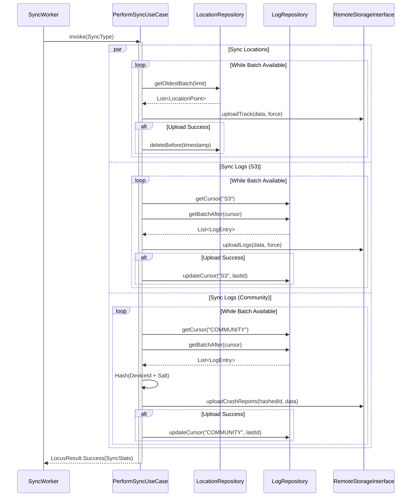
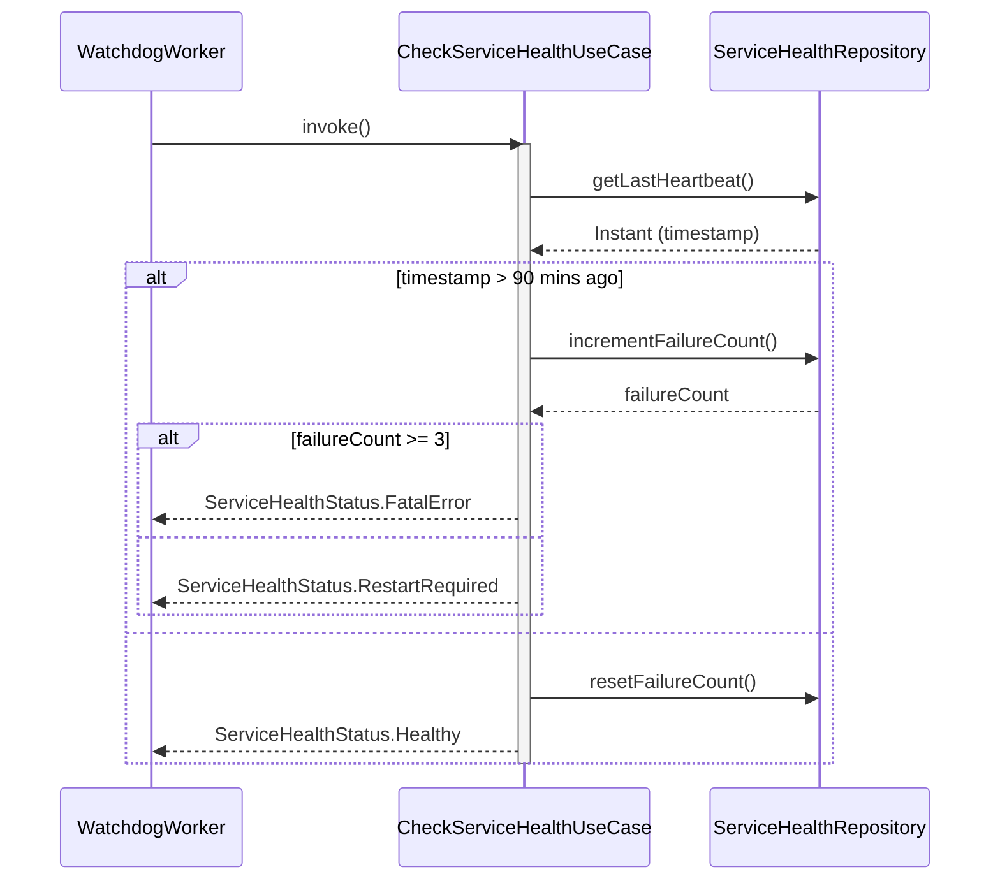
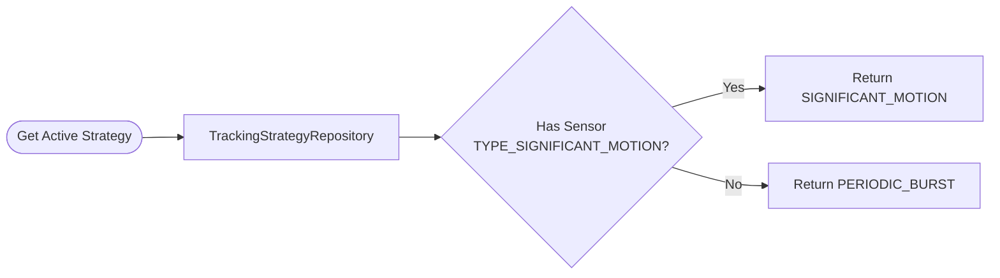
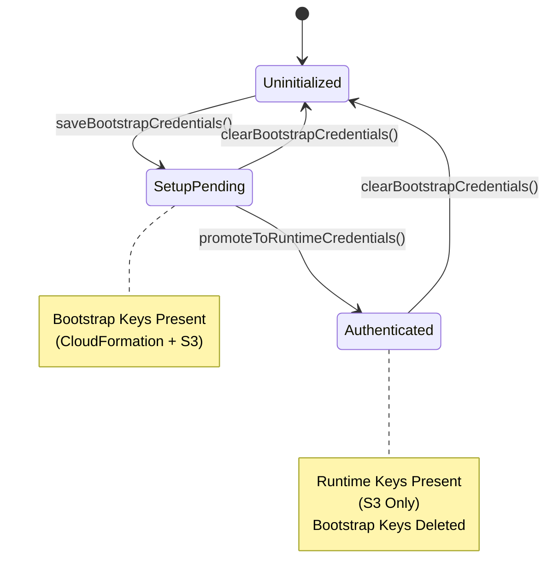

# Domain Layer Specification

**Related Requirements:** [Process Definition](../process_implementation_definition.md), [Android Architecture](../android_architecture.md)

This document defines the business logic, state management, and data contracts for the Locus application, strictly separated from the Android Framework (UI/Services) and Data Layer (Room/Retrofit).

## 1. Architecture Principles

*   **Pure Kotlin:** The Domain Layer must be purely Kotlin code with **zero** dependencies on `android.*` (except generic types if absolutely necessary, but preferably none).
*   **Reactive:** Data streams are exposed as `Flow<T>`. One-shot operations (single request-response interactions) use `suspend` functions.
*   **Result Pattern:** All operations that can fail must return a sealed `LocusResult<T>` wrapper, never throwing unchecked exceptions.
*   **Use Cases:** Complex logic involving multiple repositories or specific business rules is encapsulated in "Use Case" classes.

## 2. Domain Models

These models represent the "Truth" of the application. They are decoupled from Database Entities and API DTOs.

### 2.1. LocationPoint
Represents a single unified data point in time.

```kotlin
data class LocationPoint(
    val time: Instant,
    val coordinates: Coordinates,
    val speed: SpeedInfo,
    val battery: BatteryInfo,
    val network: NetworkContext,
    val sensors: SensorData?
)

data class Coordinates(
    val lat: Double,
    val lon: Double,
    val accuracy: Float,
    val altitude: Double
)

data class SpeedInfo(
    val speedMps: Float,
    val heading: Float // Derived or raw
)

data class BatteryInfo(
    val levelPercent: Int, // 0-100
    val isCharging: Boolean
)

data class NetworkContext(
    val cell: SignalStats?, // Level 0-4, dBm
    val wifi: SignalStats?
)

data class SignalStats(
    val level: Int,
    val dbm: Int
)

data class SensorData(
    val accel: Vector3?, // x, y, z
    val mag: Vector3?,
    val pressureHpa: Float?
)

data class Vector3(val x: Float, val y: Float, val z: Float)
```

### 2.2. LogEntry
Represents a diagnostic event.

```kotlin
data class LogEntry(
    val time: Instant,
    val level: LogLevel, // Enum: DEBUG, INFO, WARN, ERROR, FATAL
    val tag: String,
    val message: String,
    val context: LogContext // Battery, Net State at time of log
)

data class LogContext(
    val batteryLevel: Int,
    val networkState: String, // "WIFI", "CELL", "NONE"
    val metadata: Map<String, String>? // Flexible JSON storage
)
```

### 2.3. SystemState
Represents the current operational status of the device environment.

```kotlin
sealed class SystemState {
    object Normal : SystemState()
    data class LowBattery(val level: Int) : SystemState() // < 15%
    data class CriticalBattery(val level: Int) : SystemState() // < 3%
    object StorageFull : SystemState()
}
```

## 3. Repository Interfaces

Repositories define *what* data can be accessed, not *how*.

### 3.1. LocationRepository
Manages track data.

```kotlin
interface LocationRepository {
    // Write
    suspend fun recordPoint(point: LocationPoint): LocusResult<Unit>

    // Read (One-shot for Sync)
    suspend fun getOldestBatch(limit: Int): LocusResult<List<LocationPoint>>

    // Maintenance
    suspend fun deleteBefore(time: Instant): LocusResult<Unit>
    suspend fun getBufferCount(): LocusResult<Long>
}
```

### 3.2. LogRepository
Manages diagnostic logs.

```kotlin
interface LogRepository {
    suspend fun log(entry: LogEntry)

    // Read for UI (Reactive with Filtering)
    fun getLogs(filter: LogFilter): Flow<List<LogEntry>>

    // Read batch specifically for a given cursor
    suspend fun getBatchAfter(cursorId: Long, limit: Int): LocusResult<List<LogEntry>>

    // Cursor Management
    suspend fun getCursor(key: String): LocusResult<Long>
    suspend fun updateCursor(key: String, lastId: Long): LocusResult<Unit>

    // Note: No 'deleteBefore' is exposed.
    // Logs are only deleted via FIFO eviction (handled implicitly by Data Layer).
}

data class LogFilter(
    val levels: List<LogLevel>, // e.g., [WARN, ERROR]
    val searchQuery: String? = null // Optional search term
)
```

### 3.3. AuthRepository
Manages the complexity of "Bootstrap" vs. "Runtime" credentials and the granular provisioning state.

```kotlin
interface AuthRepository {
    // State Check
    fun getAuthState(): Flow<AuthState> // Uninitialized -> SetupPending -> Authenticated

    // Provisioning State (Granular for UI)
    fun getProvisioningState(): Flow<ProvisioningState>
    suspend fun updateProvisioningState(state: ProvisioningState)

    // Actions
    suspend fun saveBootstrapCredentials(creds: BootstrapCredentials): LocusResult<Unit>
    suspend fun promoteToRuntimeCredentials(creds: RuntimeCredentials): LocusResult<Unit>
    suspend fun replaceWithAdminCredentials(creds: RuntimeCredentials): LocusResult<Unit>
    suspend fun clearBootstrapCredentials(): LocusResult<Unit>
    suspend fun getRuntimeCredentials(): LocusResult<RuntimeCredentials>

}

sealed class BucketValidationStatus {
    object Validating : BucketValidationStatus()
    object Available : BucketValidationStatus()
    object Invalid : BucketValidationStatus() // Missing LocusRole tag
}

sealed class AuthState {
    object Uninitialized : AuthState()
    object SetupPending : AuthState() // Has Bootstrap
    object Authenticated : AuthState() // Has Runtime
}

// See 'provisioning-state-machine.md' for ProvisioningState definition
```

### 3.4. ConfigurationRepository
Manages app settings and unique identifiers.

```kotlin
interface ConfigurationRepository {
    suspend fun initializeIdentity(deviceId: String, salt: String): LocusResult<Unit>
    suspend fun getDeviceId(): String?
    suspend fun getTelemetrySalt(): String?
}
```

### 3.5. Infrastructure Clients
Pure Kotlin interfaces for Infrastructure access.

```kotlin
interface CloudFormationClient {
    suspend fun createStack(creds: BootstrapCredentials, stackName: String, template: String, parameters: Map<String, String>): LocusResult<String>
    suspend fun describeStack(creds: BootstrapCredentials, stackName: String): LocusResult<StackDetails>
}

data class StackDetails(val stackId: String?, val status: String, val outputs: Map<String, String>?)

interface S3Client {
    suspend fun listBuckets(creds: BootstrapCredentials): LocusResult<List<String>>
    suspend fun getBucketTags(creds: BootstrapCredentials, bucketName: String): LocusResult<Map<String, String>>
}

interface ResourceProvider {
    fun getStackTemplate(): String
}
```

### 3.6. DeviceStateRepository
Provides access to hardware status.

```kotlin
interface DeviceStateRepository {
    // Reactive stream for "Always On" service to observe
    val batteryState: Flow<SystemState>

    // One-shot for Workers
    suspend fun getCurrentSystemState(): SystemState

    // Connectivity
    fun getNetworkStatus(): Flow<NetworkStatus> // Connected/Disconnected/Metered
}
```

### 3.7. TrackingStrategyRepository
Determines the active tracking method based on hardware capabilities.

```kotlin
interface TrackingStrategyRepository {
    suspend fun getActiveStrategy(): TrackingStrategy
}

enum class TrackingStrategy {
    SIGNIFICANT_MOTION, // Hardware interrupt (Preferred)
    PERIODIC_BURST // Fallback
}
```

### 3.8. ServiceHealthRepository
Manages the Watchdog state.

```kotlin
interface ServiceHealthRepository {
    suspend fun recordHeartbeat()
    suspend fun getLastHeartbeat(): Instant?

    suspend fun incrementFailureCount(): Int // Returns new count
    suspend fun resetFailureCount()
    suspend fun getFailureCount(): Int
}
```

## 4. Use Cases (Interactors)

Encapsulates specific business rules.

### 4.1. PerformSyncUseCase
**Role:** Orchestrates the upload process (Location + Logs).
**Responsibility:**
*   Manages "Independent Cursors" for S3 vs Community logs.
*   Handles partial failures (e.g., S3 succeeds, Community fails).
*   Performs anonymization hashing (`SHA256(device_id + salt)`) before invoking Community Remote.
*   **Force Sync:** When `SyncType.MANUAL` is used, the use case MUST pass a `force=true` flag to the `RemoteStorageInterface` methods (and subsequently to the Repositories) to bypass the daily 50MB Traffic Guardrail.

**Logic:**
1.  Check `DeviceState` (skip if Critical Battery, unless Manual Sync).
2.  **Location Sync:**
    *   Fetch `OldestBatch` -> Compress -> Upload S3 (with `force` flag if Manual).
    *   Success: `LocationRepository.deleteBefore()`.
3.  **Log Sync (Dual Dispatch):**
    *   **S3 Path:**
        *   Get `Cursor_S3`.
        *   Fetch batch > `Cursor_S3`.
        *   Upload S3 (with `force` flag if Manual).
        *   Success: Update `Cursor_S3`.
    *   **Community Path:**
        *   Get `Cursor_Community`.
        *   Fetch batch > `Cursor_Community`.
        *   Generate Anonymized ID (`SHA256`).
        *   Upload Community (via Adapter).
        *   Success: Update `Cursor_Community`.

```kotlin
class PerformSyncUseCase(
    private val locationRepo: LocationRepository,
    private val logRepo: LogRepository,
    private val configRepo: ConfigurationRepository, // For Salt
    private val remoteStore: RemoteStorageInterface, // Infrastructure layer
    private val communityRemote: CommunityTelemetryRemote,
    private val deviceStateRepo: DeviceStateRepository
) {
    suspend operator fun invoke(type: SyncType): LocusResult<SyncStats>
}

enum class SyncType {
    REGULAR, // Respects all battery constraints
    RESCUE, // Ignores low battery (up to critical limit)
    MANUAL // Overrides almost all checks
}
```

### 4.2. StartTrackingUseCase
**Role:** Initializes the tracking session.
**Logic:**
1.  Verify Permissions (Location, Notification).
2.  Check `DeviceState` (Battery).
3.  Determine `TrackingStrategy` via repository.
4.  Signal Service to start.

```kotlin
class StartTrackingUseCase(
    private val deviceStateRepo: DeviceStateRepository,
    private val strategyRepo: TrackingStrategyRepository
) {
    suspend operator fun invoke(): LocusResult<Unit>
}
```

### 4.3. StopTrackingUseCase
**Role:** Cleanly ends the tracking session.

```kotlin
class StopTrackingUseCase {
    suspend operator fun invoke(): LocusResult<Unit>
}
```

### 4.4. CheckServiceHealthUseCase
**Role:** Executed by the Watchdog Worker.
**Logic:**
1.  Get `LastHeartbeat`.
2.  If `Now - LastHeartbeat > 90 mins`:
    *   `failures = repo.incrementFailureCount()`
    *   If `failures >= 3`: Return `FatalError`.
    *   Else: Return `RestartRequired`.
3.  Else: Return `Healthy`.

```kotlin
class CheckServiceHealthUseCase(
    private val healthRepo: ServiceHealthRepository
) {
    suspend operator fun invoke(): ServiceHealthStatus
}

sealed class ServiceHealthStatus {
    object Healthy : ServiceHealthStatus()
    object RestartRequired : ServiceHealthStatus()
    object FatalError : ServiceHealthStatus() // Circuit Breaker tripped
}
```

### 4.5. ScanBucketsUseCase
**Role:** Discovers available Locus buckets for account recovery.
**Logic:**
1. List all S3 buckets.
2. Filter by `locus-` prefix.
3. Check tags for `LocusRole: DeviceBucket`.
4. Return list of buckets with status (Available/Invalid).

```kotlin
class ScanBucketsUseCase(
    private val s3Client: S3Client
) {
    suspend operator fun invoke(creds: BootstrapCredentials): LocusResult<List<Pair<String, BucketValidationStatus>>>
}
```

### 4.6. ProvisioningUseCase
**Role:** Orchestrates the setup of a new device identity and infrastructure.
**Logic:**
1. Validate device name.
2. Load CloudFormation template.
3. Create Stack (`locus-user-{deviceName}`).
4. Poll until completion (10 min timeout).
5. Generate new `device_id` and `salt`.
6. Initialize Identity.
7. Promote to Runtime Credentials.

```kotlin
class ProvisioningUseCase(
    private val authRepository: AuthRepository,
    private val configRepository: ConfigurationRepository,
    private val resourceProvider: ResourceProvider,
    private val stackProvisioningService: StackProvisioningService
) {
    suspend operator fun invoke(creds: BootstrapCredentials, deviceName: String): LocusResult<Unit>
}
```

### 4.7. RecoverAccountUseCase
**Role:** Orchestrates the recovery of an existing account to a new installation.
**Logic:**
1. Validate target bucket has `LocusRole` tag.
2. Load CloudFormation template.
3. Create Stack (`locus-user-{newUuid}`) with existing bucket parameter.
4. Poll until completion (10 min timeout).
5. Generate new `device_id` and `salt` (Split Brain Prevention).
6. Initialize Identity.
7. Promote to Runtime Credentials.

```kotlin
class RecoverAccountUseCase(
    private val authRepository: AuthRepository,
    private val configRepository: ConfigurationRepository,
    private val s3Client: S3Client,
    private val resourceProvider: ResourceProvider,
    private val stackProvisioningService: StackProvisioningService
) {
    suspend operator fun invoke(creds: BootstrapCredentials, bucketName: String): LocusResult<Unit>
}
```

## 5. Common Types

### 5.1. Result Pattern
```kotlin
sealed class LocusResult<out T> {
    data class Success<out T>(val data: T) : LocusResult<T>()
    data class Failure(val exception: DomainException) : LocusResult<Nothing>()
}

open class DomainException(message: String) : Exception(message)

sealed class NetworkError(message: String) : DomainException(message) {
    object Offline : NetworkError("No Internet Connection")
    object Timeout : NetworkError("Request Timed Out")
    class Server(message: String) : NetworkError(message)
    class Generic(message: String) : NetworkError(message)
}

sealed class AuthError(message: String) : DomainException(message) {
    object InvalidCredentials : AuthError("Invalid Access Key or Secret Key")
    object Expired : AuthError("Session Token Expired")
    object AccessDenied : AuthError("Access Denied")
    class Generic(message: String) : AuthError(message)
}

sealed class S3Error(message: String) : DomainException(message) {
    object BucketNotFound : S3Error("Bucket Not Found")
    class Generic(message: String) : S3Error(message)
}

class BatteryCriticalException : DomainException("Battery too low for operation")

// Recovery Errors
sealed class RecoveryError(message: String) : DomainException(message) {
    object MissingStackTag : RecoveryError("Bucket missing stack name tag")
    object InvalidStackOutputs : RecoveryError("Stack outputs missing required credentials")
}

// Provisioning Errors
sealed class ProvisioningError(message: String) : DomainException(message) {
    object StackExists : ProvisioningError("Device name taken")
    object Permissions : ProvisioningError("Insufficient AWS Permissions")
    object Quota : ProvisioningError("AWS Quota Exceeded")
    object DeploymentFailed : ProvisioningError("Deployment Rolled Back")
    object Wait : ProvisioningError("Wait required")
}
```

## 6. Workflow Diagrams

### 6.1. Sync Workflow (PerformSyncUseCase)
This diagram illustrates the orchestration of uploading location and log data, specifically highlighting the independent cursor management for logs.



### 6.2. Service Health Check (CheckServiceHealthUseCase)
Visualizes the logic used by the Watchdog Worker to detect zombie services and manage the circuit breaker.



### 6.3. Tracking Strategy Selection
Shows how the system determines the best tracking method based on device hardware capabilities.



### 6.4. Authentication State Machine
Depicts the lifecycle of authentication states and credential promotion.


