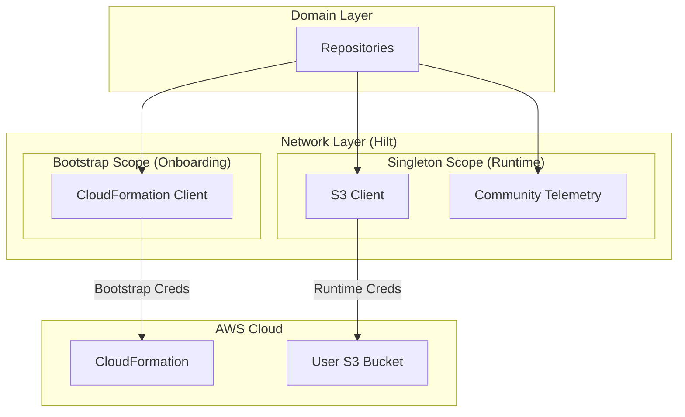
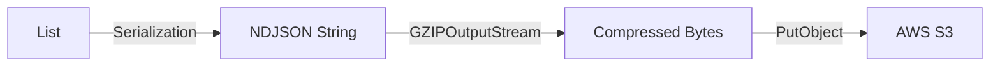
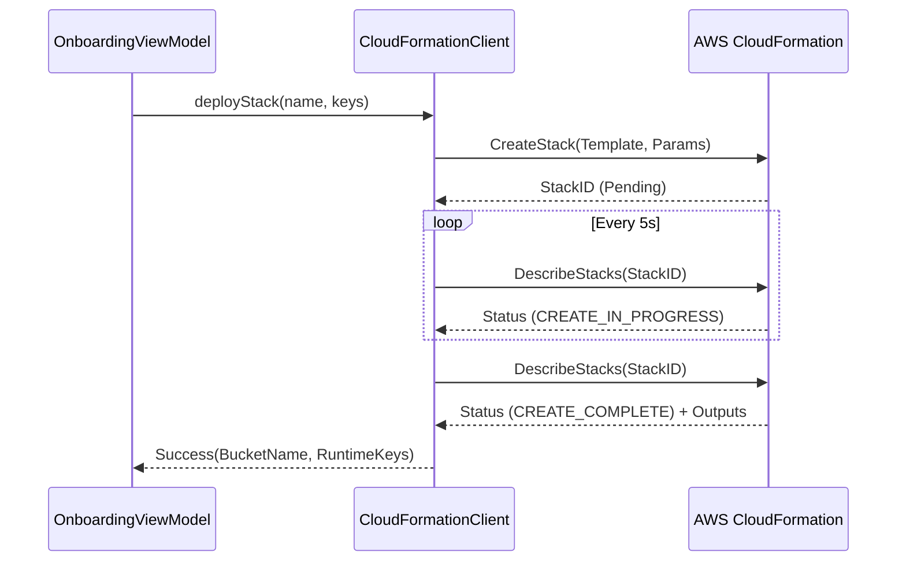

# Network & Infrastructure Specification

**Related Requirements:** [Process Definition](../process_implementation_definition.md), [Infrastructure](../infrastructure.md), [Domain Layer Spec](domain_layer_spec.md), [Data Strategy](../data_strategy.md)

This document defines the implementation of the network layer, detailing how the application interacts with AWS (CloudFormation, S3) and the optional Community Telemetry service. It mandates the use of the **AWS SDK for Kotlin** to leverage Coroutines and a "Pure Kotlin" architecture.

## 1. Architecture Overview

The Network Layer is responsible for all external communication. It sits behind the **Domain Layer** repositories, hiding the complexity of AWS SDKs, HTTP clients, and serialization.

### 1.1. Technology Stack
*   **AWS SDK:** `aws.sdk.kotlin:s3`, `aws.sdk.kotlin:cloudformation`, `aws.sdk.kotlin:sts` (Official Kotlin SDK).
*   **HTTP Client:** `OkHttp` (underlying engine for AWS SDK and Retrofit).
*   **DI:** **Hilt** (Dagger) for providing clients and handling scope.
*   **Serialization:** `kotlinx.serialization` (JSON) + `java.util.zip.GZIPOutputStream`.
*   **Concurrency:** Kotlin Coroutines & Flow.

### 1.2. Client Separation
To adhere to the "Bootstrap vs. Runtime" security model, the network layer is split into two distinct modules:

1.  **Bootstrap Module:** Handles high-privilege, ephemeral operations (Stack Deployment). Dependencies are only injected into the `OnboardingViewModel`.
2.  **Runtime Module:** Handles daily low-privilege operations (Data Upload, History Sync). Dependencies are available to the `Worker` scope and main app.

### 1.3. Architecture Diagram


## 2. AWS Client Configuration

All AWS clients must be configured with consistent timeouts, retry policies, and identification.

### 2.1. Common Configuration
*   **Region:**
    *   **Bootstrap:** Defaults to `us-east-1` (Virginia) to simplify initial stack creation.
    *   **Runtime:** Must match the region of the created S3 bucket (derived from stack outputs or config).
*   **Timeouts:**
    *   Connect: **15 seconds**
    *   Read/Write: **60 seconds** (Accommodate slow mobile networks).
*   **User Agent:** Must include app name and version (e.g., `Locus-Android/1.0.0`).
*   **Retry Policy:**
    *   **Strategy:** Exponential Backoff.
    *   **Max Retries:** 3.
    *   **Base Delay:** 1 second.
    *   **Factor:** 2.0.

### 2.2. Error Classification
The network layer must strictly classify errors to prevent battery drain from useless retries or data loss from incorrect aborts.

*   **Transient (Retry Allowed):**
    *   HTTP `408` (Request Timeout)
    *   HTTP `429` (Too Many Requests)
    *   HTTP `5xx` (Server Errors: 500, 502, 503, 504)
    *   `IOException` / `SocketTimeoutException` (Network Connectivity)
*   **Fatal (Abort Immediately):**
    *   HTTP `400` (Bad Request)
    *   HTTP `401` (Unauthorized) - Triggers Auth Alert.
    *   HTTP `403` (Forbidden) - Triggers Auth Alert.
    *   HTTP `404` (Not Found) - Bucket or Path missing.

### 2.3. Traffic Guardrail (Circuit Breaker)
To prevent unexpected costs or battery drain due to infinite loops or aggressive syncing, the network layer must enforce a strict daily quota.

*   **Limit:** **50MB per day** (Upload + Download).
*   **Scope:** This limit applies to **ALL** network traffic, including Diagnostics/Telemetry uploads and Historical Track downloads.
*   **Mechanism: Explicit Guardrail Class**
    *   An explicit `TrafficGuardrail` class is injected into all Repositories/RemoteDataSources that perform network operations.
    *   **Usage:** Before *any* network call, the repository must call `guardrail.checkQuota(force = isForced)`.
    *   If `quota > 50MB` AND `force == false`, the method throws `QuotaExceededException`.
    *   This exception is treated as a **Pause** instruction (stop syncing until tomorrow).
*   **Validation:** ArchUnit tests ensure that any class injecting `S3Client` must also inject `TrafficGuardrail`.
*   **Manual Override:**
    *   **Scenario:** User explicitly presses "Sync Now".
    *   **Mechanism:** The `SyncWorker` passes `force = true` to the Repository.
    *   **Behavior:** The `TrafficGuardrail` logs the usage but **bypasses the exception**, allowing the request to proceed.

### 2.4. Credentials Providers
*   **Bootstrap:** `StaticCredentialsProvider` using the Access Key ID and Secret Key entered by the user.
*   **Runtime:** **Dynamic Credentials Provider** (Strict Requirement).
    *   The `S3Client` MUST NOT be initialized with static keys.
    *   It must use a custom `CredentialsProvider` that queries `EncryptedSharedPreferences` *on demand* for every request.
    *   This ensures that if the user authenticates (or rotates keys), the client immediately uses the new credentials without needing to be recreated or the app restarted.

## 3. Data Transformation & Serialization

### 3.1. NDJSON Format (Wire Format)
Data is serialized into **Newline Delimited JSON** to support streaming and easy concatenation.

*   **Library:** `kotlinx.serialization`.
*   **Schema & Header:** defined in [Data Strategy](../data_strategy.md).
    *   **Header Object:** The **first line** of every file must be a JSON Header Object (Type, Version, Device ID, Start Time).
    *   **Short Keys:** The payload must use the specific short-keys (`bat`, `cs`, `cd`) defined in the Data Strategy.
*   **Mapping Responsibility:**
    *   For **Logs**: The Network Layer is **strictly responsible** for mapping the flat `LogEntity` from the database into the **Nested Wire Format** (`ctx` object) defined in `telemetry_spec.md`. The database schema is flat for SQL performance; the wire format is nested for logical structure.

### 3.2. Compression
All uploaded files must be Gzipped.

*   **Implementation:** `GZIPOutputStream` wrapping a `ByteArrayOutputStream` (for small batches) or a file stream.
*   **Flow:**
    1.  Serialize Header Object to JSON String + `\n`.
    2.  Serialize List<T> items to JSON String (line by line).
    3.  Write lines to GZIP stream.
    4.  Close stream.
    5.  Upload resulting bytes.

#### Data Pipeline Diagram


### 3.3. File Naming Convention
*   **Tracks:** `tracks/YYYY/MM/DD/<device_id>_<start_timestamp>_v1.json.gz`
    *   `v1` is the integer schema version.
*   **Logs:** `diagnostics/YYYY/MM/DD/<device_id>_<start_timestamp>_v1.json.gz`

## 4. API Interactions

### 4.1. Bootstrap Client (CloudFormation)
**Interface:** `InfrastructureProvisioner`

*   **Deploy Stack:**
    *   **Call:** `CreateStack`.
    *   **Logic:**
        *   Attempt to create the stack.
        *   If `AlreadyExistsException` is thrown (Recovery/Reinstall), strictly catch it and proceed to **Polling** (to ensure the existing stack is complete).
    *   **Parameters:**
        *   `StackName`: User-provided device name.
        *   `TemplateBody`: The YAML content of `locus-stack.yaml` (bundled in assets).
        *   `Parameters`: `StackName` (same as above).
        *   `Capabilities`: `CAPABILITY_NAMED_IAM`.
    *   **Polling:** Use `DescribeStacks` every 5 seconds to check `StackStatus`.
    *   **Success:** Status is `CREATE_COMPLETE`.
    *   **Output Retrieval:** Parse `Outputs` to get `BucketName`, `AccessKeyId`, `SecretAccessKey`.

#### Bootstrap Sequence


### 4.2. Runtime Client (S3)
**Interface:** `RemoteStorageInterface`

*   **Method Signature:** `uploadTrack(data: ByteArray, force: Boolean)`
    *   **Note:** The `force` parameter is required to bypass the Traffic Guardrail during Manual Sync.
*   **Upload Data:**
    *   **Call:** `PutObject`.
    *   **Bucket:** From Config.
    *   **Key:** Generated Path.
    *   **Body:** ByteStream (Gzipped content).
    *   **Metadata:**
        *   **Tracks:** `x-amz-object-lock-retain-until-date` = **Current Date + 100 Years**.
        *   **Diagnostics:** **NO** Object Lock header (Relies on S3 Lifecycle Policy for 30-day expiration).
    *   **Error Handling:**
        *   `S3Exception` (403/401) -> `AuthException` (Trigger user alert).
        *   `S3Exception` (5xx) / `IOException` -> `NetworkException` (Retry later).

*   **List History:**
    *   **Call:** `ListObjectsV2`.
    *   **Prefix:** `tracks/YYYY/MM/` (Lazy load by month).
    *   **Mapping:** Convert `S3Object` summaries to `TrackFileMetadata` domain objects.

*   **Download Track:**
    *   **Call:** `GetObject`.
    *   **Processing:** Stream `body` -> `GZIPInputStream` -> `BufferedReader` -> `Json.decodeFromString`.

## 5. Community Telemetry (Optional)

This module handles the optional upload of anonymous crash reports. It employs the **Adapter Pattern** to decouple the app from the specific telemetry provider (e.g., Firebase, Sentry, or custom server).

### 5.1. Interface (Port)
The Domain Layer defines the contract:
```kotlin
interface CommunityTelemetryRemote {
    fun recordCrash(t: Throwable)
    // Accepts the ALREADY HASHED ID. Hashing logic is strictly in Domain Layer.
    fun setUserId(anonymizedId: String)
    fun setCustomKey(key: String, value: String)
}
```

### 5.2. Implementation Variants (Adapters)

*   **`standard` Flavor (`FirebaseTelemetryRemote`):**
    *   **Wraps:** `com.google.firebase.crashlytics` SDK.
    *   **Logic:**
        *   `recordCrash` -> `FirebaseCrashlytics.getInstance().recordException(t)`
        *   `setUserId` -> `FirebaseCrashlytics.getInstance().setUserId(anonymizedId)`
    *   **Rationale:** Uses the managed service for the default Play Store build.

*   **`foss` Flavor (`NoOpTelemetryRemote`):**
    *   **Wraps:** None.
    *   **Logic:** All methods are empty functions (No-Op).
    *   **Rationale:** Ensures strictly no proprietary code or network calls in FOSS builds.

*   **Future Flexibility:** This interface allows future replacement with a `RestApiTelemetryRemote` (using Retrofit) to send data to a self-hosted server without modifying the Domain or Data layers.

## 6. Hilt Modules

### 6.1. `NetworkModule` (InstallIn: SingletonComponent)
*   Provides: `Json` (kotlinx configuration), `OkHttpClient` (shared configuration).
*   Provides: `TrafficGuardrail` (Singleton, injecting SharedPreferences).

### 6.2. `BootstrapModule` (InstallIn: ViewModelComponent)
*   Provides: `CloudFormationClient` (Scoped to Onboarding).

### 6.3. `RuntimeModule` (InstallIn: SingletonComponent)
*   Provides: `S3Client`, `CommunityTelemetryRemote`.
*   **Note:** `S3Client` provider must use a **Dynamic Credentials Provider** that reads from `EncryptedSharedPreferences` on every request.

## 7. Security Considerations

*   **TLS:** All connections use HTTPS (enforced by AWS SDK and Android default network security config).
*   **Memory:** Bootstrap credentials must be passed to the client builder and then explicitly cleared/nullified in the UI layer once the process is complete.
*   **Logging:** **NEVER** log headers or bodies containing Access Keys or Session Tokens. Configure AWS SDK logging to `Level.None` or `Level.Basic` (sanitized).
