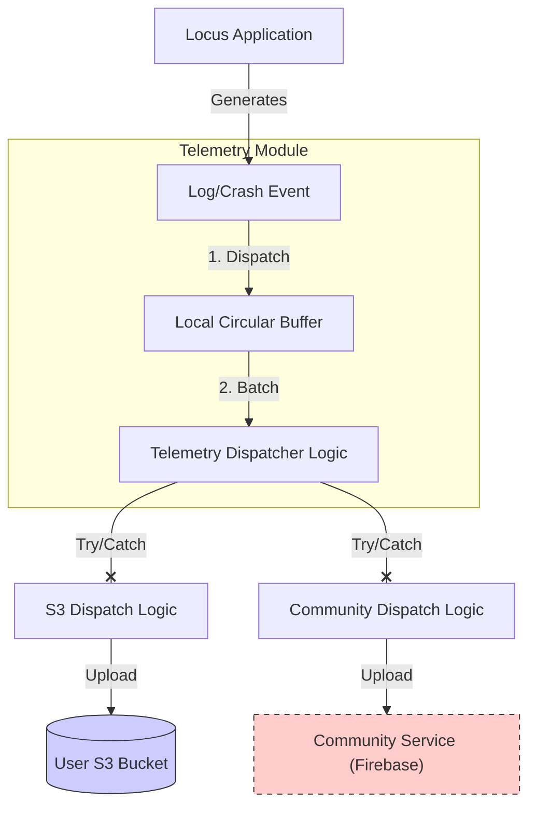

# Runtime Telemetry & Resilience

This document defines the architecture for runtime observability (logging, crash reporting, health metrics) while strictly adhering to the "User-Owned" and "Privacy-First" principles.

## 1. Core Principles

*   **Fail-Open Design:** The application **shall** continue normal operation (tracking, storing data) even if the telemetry subsystems fail completely (e.g., network unreachable, crash in logger).
*   **Data Sovereignty:** The user's S3 bucket is the **Primary Destination** for all diagnostic data.
*   **Privacy-First Compilation:** The application uses Build Variants to physically exclude proprietary tracking code from FOSS builds.
*   **Voluntary Contribution:** Reporting to a centralized "Community" service is strictly **Opt-In** and **Secondary**.

## 2. Architecture

The telemetry system utilizes a "Dual-Dispatch" model with strict isolation and build-time configuration.


*Note: The above diagram can be rendered using any Markdown editor with Mermaid support.*

**Important Clarification:** `S3 Dispatch Logic` and `Community Dispatch Logic` are **internal logical units** executed sequentially within the single `SyncWorker`. They are **not** separate Android `ListenableWorker` classes. This consolidation minimizes battery impact by waking the radio only once for both operations.

### 2.1. Build Variants (Flavors)

To respect user privacy and FOSS principles, the application **shall** be compiled in two flavors:

1.  **Standard (`standard`):**
    *   **Includes:** Firebase Crashlytics (and Google Play Services dependencies).
    *   **Purpose:** Development, Beta Testing, Google Play Store distribution.
    *   **Behavior:** Community telemetry is possible (if opted-in).
2.  **FOSS (`foss`):**
    *   **Excludes:** All proprietary libraries (Firebase, GMS).
    *   **Purpose:** F-Droid, privacy-conscious manual installs.
    *   **Behavior:** The `Community Dispatch Logic` interacts with a "No-Op" stub. Community telemetry settings are hidden or disabled.

## 3. Destinations

### 3.1. Primary: User S3 (Diagnostics)
*   **Purpose:** Full fidelity debugging, crash dumps, and performance metrics.
*   **Path:** `s3://<user-bucket>/diagnostics/YYYY/MM/DD/<device_id>_<timestamp>.ndjson.gz`
*   **Retention:** Controlled by S3 Lifecycle Policy (Strict **30 Days**).
*   **Format:** NDJSON (Newline Delimited JSON) for machine parseability.

#### Log Schema (Wire Format)
The following JSON schema defines the **Wire Format** (NDJSON) used for uploads. Note that the internal database schema (defined in `data_persistence_spec.md`) may be flatter for performance; the Network Layer is responsible for mapping to this nested structure.

```json
{
  "ts": "2023-10-27T10:00:00.123Z",  // ISO 8601 Timestamp
  "lvl": "WARN",                     // INFO, WARN, ERROR, FATAL
  "tag": "TrackerService",           // Component Name
  "msg": "GPS signal lost for 30s",  // Human-readable message
  "ctx": {                           // Environmental Context
    "bat": 85,                       // Battery Level %
    "chg": false,                    // Is Charging?
    "net": "wifi",                   // Network Type (wifi, cell, none)
    "perm": true,                    // Is Location Permission Granted?
    "svc": true                      // Is Tracker Service Running?
  },
  "stack": "..."                     // Optional: Stack Trace for Errors
}
```

### 3.2. Secondary: Community Service (Opt-In)
*   **Service:** Firebase Crashlytics (via `FirebaseTelemetryRemote`).
*   **Mechanism:** Native SDK integration (Standard Flavor only).
*   **Schema:** Defined implicitly by the Firebase Crashlytics platform (Stacks, Keys, User IDs). No custom JSON schema is required at this stage.
*   **Privacy Strategy:** "Salted Anonymity"
    *   **The Risk:** Linking a crash report (containing app state) to a public track file (containing `device_id`).
    *   **The Solution:** The app generates a random UUID (`telemetry_salt`) at install time, stored in `EncryptedSharedPreferences`.
    *   **The ID:** The ID sent to Firebase is `SHA256(device_id + telemetry_salt)`.
    *   **Result:** Developers can correlate crashes from the same device *without* knowing which User S3 bucket or real-world identity it belongs to.

## 4. Resilience & Fail-Open Requirements

To ensure the "Fail-Open" mandate:

1.  **Isolation:** Telemetry operations **must** run in isolated Coroutine scopes (e.g., `Dispatchers.IO`) wrapped in top-level `try-catch` blocks.
    *   **Requirement:** A crash in the logging subsystem **must never** propagate to the calling thread (e.g., the tracking loop).
    *   **Buffer Safety:** The *Local Circular Buffer* shall use a low-level, robust implementation (e.g., `mmap` or file-append) to maximize the chance of persisting logs even during a process crash (Tombstone support[^1]).

[^1]: **Tombstone Support:** The ability to read the final log buffer state from disk even after the application process has completely died/crashed (e.g., due to an OS kill or unhandled exception).

2.  **Exception Swallowing (Best Effort Retry):**
    *   **IF** a telemetry upload fails, **THEN** the system **shall** catch the exception and abort the **current attempt**.
    *   **The system shall not** retry immediately (to preserve battery).
    *   **Implicit Retry:** The failed logs **remain in the Local Circular Buffer**. They will naturally be included in the **next scheduled upload batch**.

3.  **Independent Storage & Eviction Strategy:**
    To maximize data availability for the user while decoupling S3 from Community failures, the system uses a **Single Circular Buffer with Independent Cursors**.
    *   **Implementation:** See [Data Persistence Spec](data_persistence_spec.md) for `LogEntity` (Buffer) and `CursorEntity` (Progress Tracking) definitions.
    *   **Single Source of Truth:**
        *   All logs are written to a single, fixed-size circular buffer (e.g., **5MB Limit**).
        *   This buffer is the **exclusive source** for the on-device "Logs" screen.
    *   **Retention Policy (FIFO):**
        *   Data in the **Local Buffer** is **NEVER** deleted based on upload status.
        *   **Cursors:** The `Cursor_S3` and `Cursor_Community` stored in `CursorEntity` are advanced only upon successful upload.
        *   **Eviction:** Data is **ONLY** overwritten/deleted from the buffer when the buffer reaches its capacity (5MB).
        *   **Rationale:** This guarantees that the user always has access to the most recent ~5MB of logs for immediate on-device debugging, even if all network uploads are failing or have already succeeded.

4.  **Circuit Breaking & Traffic Guardrails:**
    *   **Failures:** IF telemetry uploads fail consecutively for > 5 attempts, **THEN** the Telemetry Module **shall** enter a "Backoff" state for 6 hours.
    *   **Traffic Quota:** The daily **50MB Traffic Guardrail** defined in the [Network & Infrastructure Spec](network_infrastructure_spec.md) applies to **all** network traffic, including Diagnostics and Telemetry. Telemetry uploads must be paused if this quota is exceeded (unless manually forced).

## 5. Implementation Definition

### 5.1. Local Logs Screen
The on-device "Logs" screen is a direct view of the **Local Circular Buffer**.
*   **Scope:** Strictly displays the contents of the local buffer (last ~5MB).
*   **No Remote Fetch:** The app **shall not** attempt to download or merge historical log files from S3. Deep historical analysis must be performed by downloading the files from S3 to a desktop computer.
*   **Features:**
    *   Scrollable list of recent logs.
    *   Color-coded by level (WARN/ERROR).
    *   "Copy to Clipboard" / "Share" button for manual reporting.

### 5.2. Configuration
*   `enable_community_telemetry`: Boolean (Default: `false`). Only visible/effective in `Standard` build.
*   `enable_s3_diagnostics`: Boolean (Default: `true`).
*   `telemetry_salt`: String (UUID). Generated once on first run.
